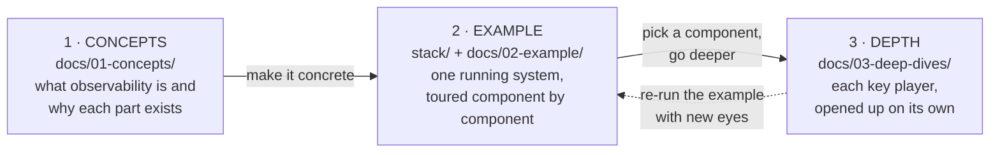

# O11y Micro-Service — observability for microservices, from overview to depth

A self-paced study of how modern observability works, organized the way understanding actually grows: **learn the concepts → see them run in one concrete example → then go deep on each key player, one at a time.**



## The path

| Stage | Where | What you get |
|---|---|---|
| **1 · Concepts** | [docs/01-concepts/](docs/01-concepts/00-overview.md) | The whole territory: signals, instrumentation, context propagation, pipelines, backends, consumption, outside-in monitoring — and how OTel, Prometheus, Grafana, Splunk, and AppDynamics divide the work. Ends with a narrated "checkout is slow" incident. |
| **2 · Example** | [stack/](stack/README.md) *(runnable)* + [docs/02-example/](docs/02-example/00-overview.md) *(the tour)* | Stage 1 made real: a 5-service Spring Boot shop with OTel agents, agent/gateway Collectors, Tempo, Prometheus, Loki, and Grafana in docker-compose. The tour follows one request's telemetry through every container; the stack can also reproduce the Stage-1 incident with one env var. |
| **3 · Depth** | [docs/03-deep-dives/](docs/03-deep-dives/README.md) | One pack per key player, in full detail. Available now: **[OpenTelemetry](docs/03-deep-dives/otel/00-overview.md)** (signals, context, Collector, sampling). The [index](docs/03-deep-dives/README.md) lists what's planned next. |

Every pack follows the same progression — *Why → What → How → Walkthrough* — so you always meet the problem before the definition, and the definition before the mechanism.

## Where to start

- **New to observability?** Read straight through: [01-concepts](docs/01-concepts/00-overview.md) → bring up [the stack](stack/README.md) → walk [02-example](docs/02-example/04-walkthrough.md).
- **Know the concepts, want hands-on?** `cd stack && docker compose up -d --build`, then the [tour walkthrough](docs/02-example/04-walkthrough.md).
- **Chasing one component?** Jump into [03-deep-dives](docs/03-deep-dives/README.md), then use the [example's exercises](docs/02-example/05-next-steps.md) to poke that component live.

## Repo layout

```
README.md              ← you are here: the journey map
Prompt.md              ← running study TODO list
docs/
  01-concepts/         ← stage 1: the observability guide (why→what→how→walkthrough)
  02-example/          ← stage 2: the running stack, explained container by container
  03-deep-dives/       ← stage 3: one deep pack per key player (otel/ today; more to come)
  plan/                ← archived working plans
stack/                 ← stage 2's implementation: docker-compose + Spring Boot services + configs
```
