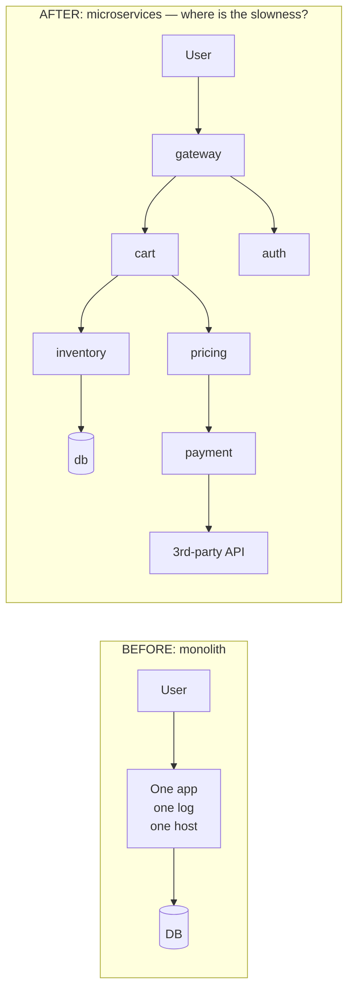
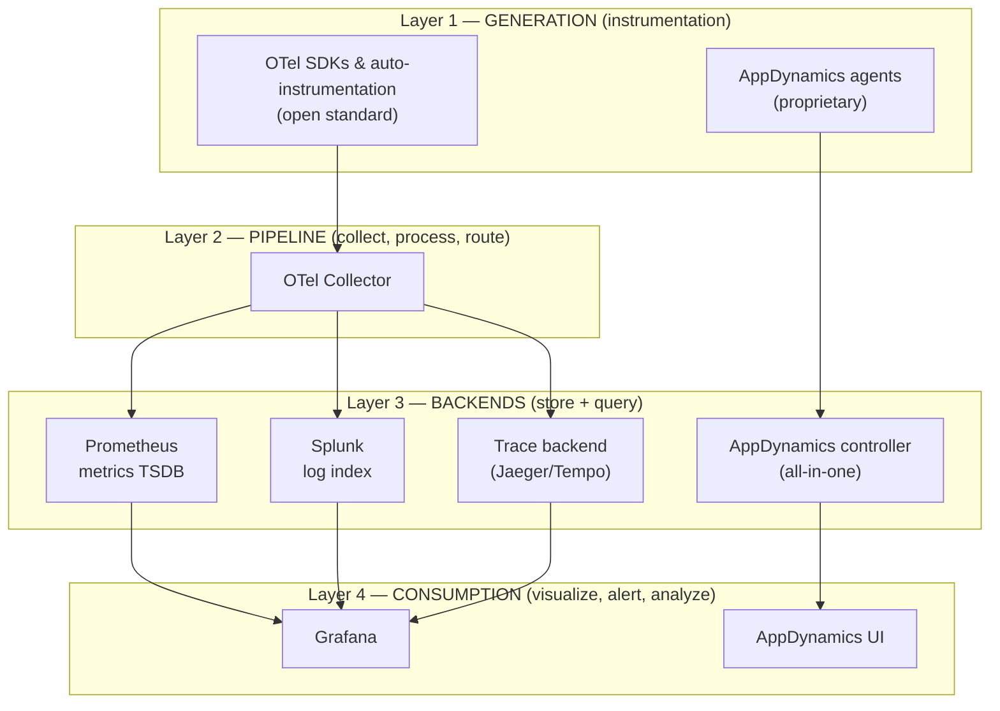

# Why Monitoring Broke When We Split the Monolith (and What Observability Actually Means)

*Part 1 of a series on observability for microservices — concepts, a runnable stack, and deep dives into OpenTelemetry. [Series index](00-index.md).*

📦 GitHub: [https://github.com/geekchow/O11y-Micro-Service](https://github.com/geekchow/O11y-Micro-Service)

If you've ever been paged for "checkout is slow" and spent forty minutes staring at green dashboards before finding the actual problem, this post is about why that happens and what changed in how we're supposed to solve it.

## Monitoring worked fine — until it didn't

In the monolith era, "monitoring" was a short, closed checklist:

- One (or a few) servers → check CPU, memory, disk with Nagios or Zabbix.
- One process → tail one log file on one machine.
- One call stack → profile a slow request *in place*, in a debugger, on the box.

You could enumerate what might go wrong ahead of time and write a check for each one. That's the whole definition: **monitoring is asking questions you already knew to ask.**

Split that monolith into 40 services running on ephemeral containers, and every one of those assumptions dies at once:

| Monolith assumption | Microservices reality | Concrete pain |
|---|---|---|
| One log file | Thousands of log streams, gone when the container dies | You can't `ssh` in and `grep` — the evidence disappeared with the pod |
| One call stack | A user request hops 8–15 services | "Checkout is slow" — but *which* of the 12 hops? Nobody can say |
| Known failure modes | Emergent failures: retry storms, partial outages, noisy neighbors | You can't write a check for a failure you've never imagined |
| Host-centric health | A host can be healthy while the *user experience* is broken | All dashboards green, customers still complaining |
| Slow release cadence | Many deploys per day | "What changed?" has thirty possible answers per hour |

Same complaint, before and after — but the "after" picture has no single place to look.

## Why the obvious fixes weren't enough

1. **Host monitoring (Nagios-style checks)** answers "is the server up?" — not "why is *this specific request* slow across 12 services?" It only ever catches **known-unknowns**.
2. **Logs + grep** still exist, but they're scattered across ephemeral containers and, critically, **uncorrelated** — nothing links service A's log line to service B's log line for the same request.
3. **First-generation APM** (proprietary agents from vendors like early AppDynamics or New Relic) gave deep visibility, but locked you into one vendor's data format. Instrument once, pay forever; mixing vendors across teams meant telemetry you couldn't join.
4. **Metrics-only stacks** tell you *that* p99 latency spiked — cheap and aggregatable — but aggregation destroys the per-request detail you need to answer *why*.

## The constraints that shaped what we have now

Four pressures forced the shape of the modern stack:

- **Cardinality & cost.** You cannot store everything about every request. So: cheap aggregates (metrics) for detection, expensive detail (traces/logs) for diagnosis, sampling in between.
- **Correlation.** Signals in isolation are nearly useless — you need a shared key that ties them together across every hop (this turns out to be a `trace_id`, more on that in a later post).
- **Vendor neutrality.** Nobody wants to re-instrument every service because they switched log vendors. Hence a standard — OpenTelemetry — that separates *generating* telemetry from *storing and analyzing* it.
- **Outside-in truth.** Server-side telemetry can't see a broken CDN or a JS error in a user's browser. Hence synthetic checks and real-user monitoring (RUM), which measure from the user's side.

## The actual definition

> **Monitoring** = watching for failures you predicted.
> **Observability** = being able to ask arbitrary new questions of a running system, from its outputs, without shipping new code.

Under microservices, the second one stopped being a luxury. If observability didn't already exist as a discipline, you'd be forced to invent it this week.

More precisely:

> **Observability** is a property of a system — achieved through a telemetry pipeline — that lets engineers answer previously-unasked questions about cross-service behavior by emitting, correlating, and analyzing **metrics, logs, and traces**.

Monitoring, alerting, tracing, and APM are all *practices built on top of* that property, not synonyms for it:

| Term | Meaning | Direction |
|---|---|---|
| Monitoring | Continuously evaluating known health signals against expectations | inside-out, passive |
| Alerting | Turning a threshold/anomaly breach into a routed notification | inside-out, passive |
| Logging | Recording discrete, richly-detailed events for later search | inside-out, passive |
| Tracing | Reconstructing one request's journey as a tree of timed spans | inside-out, passive |
| APM | An opinionated bundle of the above, application-centric | inside-out, passive |
| Synthetics | Scripted robots running user journeys from outside, 24/7 | **outside-in, active** |
| RUM | Telemetry from real users' browsers/apps: load time, JS errors, Web Vitals | **outside-in, passive** |

And three things observability is explicitly **not**:

- **Not a tool you install.** Buying a vendor product doesn't make uninstrumented code observable — it still emits nothing worth analyzing.
- **Not debugging or profiling.** It narrows *where* and *why at the system level*; a debugger and a CPU profiler still take over below that.
- **Not "store everything."** Sampling and aggregation are deliberate features — full-fidelity capture of every request is economically impossible at scale, and we'll spend a whole later post on exactly how the sampling trade-off is engineered.

## Where the tools actually sit

Five common tools — OpenTelemetry, Prometheus, Grafana, Splunk, and AppDynamics — aren't five competitors. They occupy different layers of one pipeline:

- **OpenTelemetry** generates and routes telemetry. It stores and visualizes nothing — it's the plumbing everything else drinks from.
- **Prometheus** owns metrics (cheap numeric time series, pull-scraped); **Splunk** owns logs (expensive rich events, pushed and indexed). Not competitors — you typically run both.
- **Grafana** stores no telemetry at all; it's the single pane of glass querying Prometheus, Splunk, and a trace backend side by side.
- **AppDynamics** is the "buy the integrated suite" philosophy — one vendor's agent, backend, and UI, in exchange for license cost and less flexibility, versus composing open pieces yourself.

That's the whole map. In the next post we go one level deeper: how these seven concepts — signals, instrumentation, context propagation, the pipeline, backends, consumption, and outside-in signals — cooperate to actually resolve a real incident, end to end.

➡️ **Next:** [Part 2 — How the Pieces Fit Together (and a 25-Minute Incident, Traced End to End)](02-how-it-fits-together.md)
