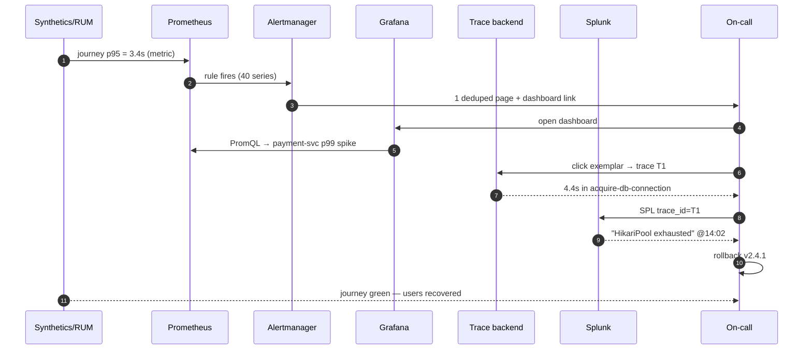

# How the Pieces Fit Together — A 25-Minute Incident, Traced End to End

*Part 2 of a series on observability for microservices. [Part 1](01-why-monitoring-broke.md) covered why monitoring broke under microservices and where the tools sit. [Series index](00-index.md).*

Seven concepts and five tools, on paper, don't tell you how an actual incident gets solved. This post walks through the seven concepts once, briefly, then spends the rest of its length on one realistic 25-minute incident — a connection-pool exhaustion bug — resolved end to end using every layer from Part 1.

## The seven concepts, in dependency order

Each one only builds on the ones above it:

| # | Problem | Concept | Definition |
|---|---|---|---|
| 1 | Evidence a system emits about itself | **Telemetry signal** | **Metric** (cheap pre-aggregated number), **log** (rich discrete event), **trace** (a tree of timed spans reconstructing one request's journey) |
| 2 | Code has to actually emit signals | **Instrumentation** | SDK/manual (you call the API) or auto/agent (bytecode/eBPF injection, zero code change) |
| 3 | Link service A's signals to service B's, for the same request | **Context propagation** | A `trace_id` + `span_id` carried in a request header (W3C `traceparent`) across every hop — *the* correlation key |
| 4 | Ship signals without coupling every app to every backend | **Telemetry pipeline** | Receives, processes (batch/filter/sample), and exports — decouples generation from storage |
| 5 | Store each signal the way it's queried | **Backend** | A TSDB for metrics, an inverted index for logs, a trace store keyed by `trace_id` |
| 6 | Humans must detect and diagnose | **Consumption** | Dashboards, alerts (with dedup/routing), analysis UIs |
| 7 | Server-side telemetry can't see what users see | **Outside-in signals** | Synthetics (scripted robot checks) and RUM (real browser telemetry) |

The design insight worth remembering: **each component refuses to do the others' job.** OTel never stores anything. Prometheus never touches logs. Grafana stores nothing at all — kill it and recreate it, and no data is lost. That single-responsibility discipline is what makes the pipeline debuggable when something in it breaks.

## The incident

**The scene:** an e-commerce app — `gateway → cart → payment → Postgres`, plus `auth` and `inventory`. Tuesday, 14:02. A deploy ships `payment-service v2.4.1`, which accidentally halves the database connection pool from 20 to 10. Traffic is moderate. Nothing turns red immediately.

### T–0 — the standing setup

Every service runs the OTel Java agent — auto-instrumentation, zero code change:

```bash
java -javaagent:opentelemetry-javaagent.jar \
  -Dotel.service.name=payment-service \
  -Dotel.exporter.otlp.endpoint=http://otel-collector:4317 \
  -jar payment.jar
```

The OTel Collector routes each signal to its backend from one config file — one place to change, three destinations:

```yaml
receivers:  { otlp: { protocols: { grpc: {} } } }
processors:
  batch: {}
  tail_sampling:            # keep all slow/error traces, 1% of the rest
    policies:
      - { name: errors,  type: status_code, status_code: {status_codes: [ERROR]} }
      - { name: slow,    type: latency,     latency: {threshold_ms: 2000} }
      - { name: sample,  type: probabilistic, probabilistic: {sampling_percentage: 1} }
exporters:
  prometheusremotewrite: { endpoint: http://prometheus:9090/api/v1/write }
  splunk_hec:            { endpoint: https://splunk:8088, token: ${HEC_TOKEN} }
  otlp/traces:           { endpoint: http://tempo:4317 }
service:
  pipelines:
    metrics: { receivers: [otlp], processors: [batch], exporters: [prometheusremotewrite] }
    logs:    { receivers: [otlp], processors: [batch], exporters: [splunk_hec] }
    traces:  { receivers: [otlp], processors: [tail_sampling, batch], exporters: [otlp/traces] }
```

A synthetic browser check runs the full checkout journey every minute from three regions; a RUM snippet in the storefront reports real-user timings.

### T+4 — 14:06 — outside-in detection fires first

Under afternoon load, connections queue. The synthetic check's checkout step breaches 3 seconds; RUM shows real-user "time to order confirmation" climbing. This trips a Prometheus alert rule:

```yaml
- alert: CheckoutSyntheticSlow
  expr: synthetic_journey_duration_seconds{journey="checkout", quantile="0.95"} > 3
  for: 3m
  labels: { severity: page, team: payments }
  annotations:
    summary: "Checkout synthetic p95 {{ $value }}s (SLO 3s)"
    dashboard: "https://grafana/d/checkout-slo"
```

### T+7 — 14:09 — alerting, deduplicated

Forty per-region/per-quantile series are firing at once. Alertmanager groups them into **one** page — its whole job is dedup, grouping, and routing, not deciding *when* to fire:

```yaml
route:
  group_by: [alertname, team]
  group_wait: 30s
  receiver: pagerduty-payments
```

One PagerDuty page, with a Grafana link. Not forty.

### T+9 — 14:11 — localize with metrics

In Grafana, the checkout dashboard's RED panels point at one service with a single PromQL query:

```promql
histogram_quantile(0.99,
  sum by (service, le) (rate(http_server_duration_seconds_bucket[5m])))
```

Only `payment-service` has p99 jumping from 300ms to 4.8s — and the deployment-annotation line at 14:02 sits right at the knee of the curve. *Which* service is answered. *Why* is not — metrics aggregated away the detail, by design.

### T+11 — 14:13 — isolate with a trace

The latency panel shows **exemplar** dots — sampled trace IDs stamped onto the metric. Clicking a 4.9s dot opens trace `T1` in the trace backend, kept by the Collector's tail-sampler *because* it was slow:

```
gateway   POST /checkout ......................... 4,910 ms
 ├─ auth  verify ................................      35 ms
 ├─ cart  get ...................................      48 ms
 └─ payment  charge ............................. 4,760 ms
     ├─ acquire-db-connection ................... 4,410 ms   ⚠
     └─ pg  INSERT payment ......................      95 ms
```

Not the database. Not the application code. *Waiting for a connection.* One click crossed four services because context propagation stamped the same `trace_id` on every span along the way.

### T+13 — 14:15 — explain with logs

From the slow span, "view logs" pivots into Splunk — possible only because the OTel SDK injected `trace_id` into every log line:

```spl
index=prod service=payment-service trace_id=4bf92f35* | sort _time
```

```
14:11:02 WARN  HikariPool-1 - pool exhausted (10/10 busy), request queued
14:11:06 INFO  connection acquired after 4410 ms
```

Widening the search shows the warnings began at exactly 14:02. A second search against deploy logs confirms `v2.4.1` changed `pool.max=20 → 10`. Root cause found in 13 minutes.

### T+22 — 14:24 — resolution

Rollback ships. Recovery happens in the same order the incident was detected: Prometheus p99 falls, the synthetic journey goes green, RUM Web Vitals recover (proof *users* are fixed, not just servers), and Alertmanager auto-resolves the page.



## The pattern, generalized

Notice the funnel shape: **synthetics and RUM detect** the user-facing symptom (outside-in) → **metrics localize** which service (cheap, aggregated) → **a trace isolates** which exact hop (expensive, kept because it was interesting) → **logs explain** why (rich detail, joined by the same key). Each layer hands the `trace_id` to the next. That's not a coincidence of this particular incident — it's the entire reason the pipeline is shaped the way it is.

If you have AppDynamics or a similarly integrated APM suite instead of this composable stack, the same 13 minutes look different but arrive at the same place: a "Business Transaction" deviates from its learned baseline, a flow map turns red at the failing edge, and an auto-captured snapshot shows the same connection-wait stack. Same conclusion, different philosophy — one bundles detection/localization/isolation into one product, the other chains five single-purpose tools around a shared `trace_id`.

Now that the concepts have a face, the next post moves from "here's the theory" to "here's a docker-compose stack you can actually run" — a five-service Spring Boot shop wired up with exactly this pipeline.

➡️ **Next:** [Part 3 — Building a Runnable Observability Stack](03-building-a-runnable-stack.md)
