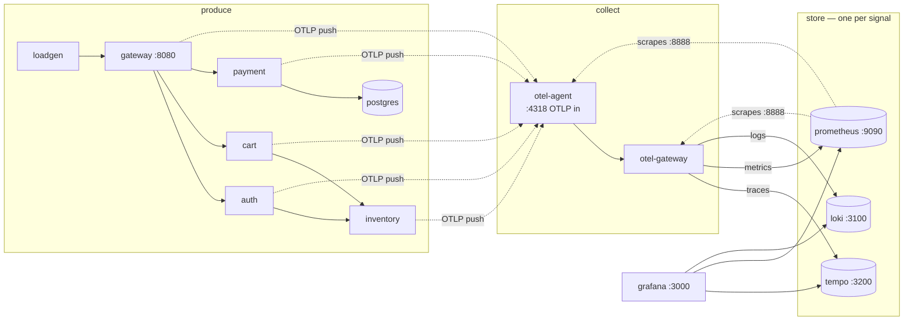

# Building a Runnable Observability Stack: 13 Containers, Each Earning Its Place

*Part 3 of a series on observability for microservices. [Part 1](01-why-monitoring-broke.md) covered the concepts; [Part 2](02-how-it-fits-together.md) walked a full incident. This post moves from theory to something you can `docker compose up`. [Series index](00-index.md).*

📦 GitHub: [https://github.com/geekchow/O11y-Micro-Service](https://github.com/geekchow/O11y-Micro-Service)

Theory is cheap; a stack you can actually run is not. This post — and the full source in the [companion repo's `stack/`](../stack/) — builds a 5-service Spring Boot shop wired with OpenTelemetry, two tiers of Collector, and one backend per signal type: Tempo for traces, Prometheus for metrics, Loki for logs, all correlated in Grafana.

```
loadgen ─→ gateway ─→ auth
              │  └──→ cart ─→ inventory
              └─────→ payment ─→ Postgres (HikariCP)

all services (OTel Java agent) ─OTLP→ otel-agent ─→ otel-gateway ─┬→ Tempo   (traces, tail-sampled)
                                                    (spanmetrics) ├→ Prometheus (metrics + exemplars)
                                                                  └→ Loki    (logs, trace_id attached)
                                                                       ↑ all three queried by Grafana
```

## Why 13 containers, and not 3

It's tempting to think "a Spring Boot app with a Prometheus sidecar" would already be observable. It would — for the metrics signal only. Every extra container in this stack exists because one specific concept from Part 1 and Part 2 *demands its own visible process*:

| Concept | Container(s) | Why it can't be merged away |
|---|---|---|
| Microservices make requests cross processes | `gateway, auth, cart, inventory, payment` | With one service there's nothing to propagate context *across* — the whole trace story disappears |
| Instrumentation (auto) | the javaagent inside each service (a jar, not a container) | Auto-instrumentation must live in-process; it can't be a sidecar |
| Pipeline, agent tier | `otel-agent` | Apps offload fast to something node-local; skip it and every service holds vendor/routing config directly |
| Pipeline, gateway/policy tier | `otel-gateway` | Tail sampling and backend routing are fleet-wide policy — one place to change, one place to watch |
| Sampling | lives inside `otel-gateway` | Needs a whole trace to judge it, so it must sit *after* every service's spans converge |
| Signal-specialized backends | `tempo` + `prometheus` + `loki` | One store per signal shape — merging them is the anti-pattern the whole design warns against |
| Consumption / correlation surface | `grafana` | Stores nothing, queries all three — proof the UI is swappable without touching data |
| Someone must generate traffic | `loadgen` | Observability of an idle system shows nothing |
| The shop needs real work to do | `postgres` | Gives payment a genuine bottleneck resource (the connection pool) so latency has a *cause* |

Two things you might expect that are deliberately missing:

- **No Alertmanager** — the alert *rule* lives in Prometheus (detection); only delivery plumbing is omitted, to keep the demo runnable on a laptop.
- **No synthetics/RUM** — outside-in signals need a probe *outside* the compose network; a container inside it would be lying about what it measures.

## The inventory, precisely

| Container | Image | Host ports | Deliberately does NOT |
|---|---|---|---|
| `gateway` | built from `services/` | 8080 | know about any backend — it only speaks OTLP to `otel-agent` |
| `auth`, `cart`, `inventory` | same build | — | do manual instrumentation — they show what the javaagent gives for free |
| `payment` | same build | — | hide its bottleneck — the Hikari pool size is env-driven on purpose |
| `postgres` | `postgres:16-alpine` | — | emit telemetry (it's the *subject* of observation via payment's spans) |
| `loadgen` | `curlimages/curl` | — | wait for responses (open-loop load) |
| `otel-agent` | `otel/opentelemetry-collector-contrib:0.156.0` | 13133 health · 55679 zpages · 8888 self-metrics | sample, analyze, or talk to backends — it enriches, batches, forwards |
| `otel-gateway` | same image | 13134 health · 55680 zpages · 8889 self-metrics | retain anything beyond its sampling buffer and export queues |
| `tempo` | `grafana/tempo:2.8.1` | 3200 | metrics or logs; alerting |
| `prometheus` | `prom/prometheus:v3.13.0` | 9090 | per-request detail — that's what exemplars point *away* to |
| `loki` | `grafana/loki:3.7.3` | 3100 | parse/structure your logs — structure arrives from the OTel appender |
| `grafana` | `grafana/grafana:12.0.2` | 3000 | store telemetry — kill it and re-create it, nothing lost |



One boundary worth stating twice: **telemetry flows left-to-right only.** No service knows Tempo exists; no backend knows the shop exists. The two Collector containers are the only place where "where does telemetry go" gets decided.

## The application-side wiring is almost all environment variables

This is the whole point of the API/SDK split: none of the five Spring Boot services import a Tempo or Prometheus client. They all get one shared block in `docker-compose.yml`:

```yaml
x-otel-env: &otel-env
  OTEL_EXPORTER_OTLP_ENDPOINT: http://otel-agent:4318
  OTEL_EXPORTER_OTLP_PROTOCOL: http/protobuf
  OTEL_TRACES_SAMPLER: parentbased_always_on   # head sampling off; tail policies decide
  OTEL_METRIC_EXPORT_INTERVAL: "15000"
  OTEL_RESOURCE_ATTRIBUTES: service.version=1.0.0

services:
  payment:
    build: { context: services, args: { SERVICE: payment } }
    environment:
      <<: *otel-env
      OTEL_SERVICE_NAME: payment
      DB_URL: jdbc:postgresql://postgres:5432/shop
      HIKARI_MAX_POOL: ${POOL_SIZE:-20}   # the incident knob (.env)
      CHARGE_DB_SECONDS: ${CHARGE_DB_SECONDS:-0.6}
```

`HIKARI_MAX_POOL` is deliberately env-driven — it's the one knob that lets this stack reproduce the exact connection-pool incident from Part 2, without touching a line of code. We'll pull that lever in a later post.

The only hand-written instrumentation anywhere in the shop is business-level — the part auto-instrumentation can't know on its own. Here's the entire `checkout` endpoint in the gateway service:

```java
@PostMapping("/checkout")
public ResponseEntity<Map<String, Object>> checkout(@RequestBody CheckoutRequest req) {
    Span span = tracer.spanBuilder("checkout").startSpan();
    try (Scope spanScope = span.makeCurrent();
         Scope baggageScope = Baggage.current().toBuilder()
                 .put("tenant.id", req.tenant() == null ? "unknown" : req.tenant())
                 .build().makeCurrent()) {

        auth.get().uri("/verify").retrieve().toBodilessEntity();

        Map<?, ?> cartBody = cart.get().uri("/cart/{id}", req.cartId()).retrieve().body(Map.class);
        int itemCount = /* ... */ 0;
        span.setAttribute("cart.item_count", itemCount);

        String orderId = UUID.randomUUID().toString();
        try {
            payment.post().uri("/charge")
                    .contentType(MediaType.APPLICATION_JSON)
                    .body(Map.of("orderId", orderId, "amountCents", req.amountCents()))
                    .retrieve().toBodilessEntity();
        } catch (HttpClientErrorException e) {
            if (e.getStatusCode().value() == 402) {
                span.setStatus(StatusCode.ERROR, "card_declined");
                log.warn("checkout {} declined by payment service", orderId);
                return ResponseEntity.status(HttpStatus.PAYMENT_REQUIRED)
                        .body(Map.of("orderId", orderId, "status", "declined"));
            }
            throw e;
        }

        ordersPlaced.add(1);
        log.info("checkout {} completed: {} items, {} cents", orderId, itemCount, req.amountCents());
        return ResponseEntity.ok(Map.of("orderId", orderId, "status", "paid"));
    } finally {
        span.end();
    }
}
```

Everything else — the HTTP server span, the outgoing client spans to `auth`/`cart`/`payment`, the trace context injected into those calls' headers — comes free from the Java agent. This method only adds three things the agent *can't* know: a business-named span (`checkout`), a business attribute (`cart.item_count`), and a business counter (`orders_placed`).

## The gateway Collector: where fleet-wide policy lives

The `otel-gateway` container is the one file that decides where every signal ends up:

```yaml
processors:
  tail_sampling:
    decision_wait: 10s
    num_traces: 20000
    policies:
      - name: errors
        type: status_code
        status_code: { status_codes: [ERROR] }
      - name: slow
        type: latency
        latency: { threshold_ms: 2000 }
      - name: baseline
        type: probabilistic
        probabilistic: { sampling_percentage: 25 }   # 1% in production; 25% here so Tempo has plenty to explore

service:
  pipelines:
    traces:                       # the culled stream → Tempo
      receivers: [otlp]
      processors: [memory_limiter, tail_sampling, batch]
      exporters: [otlp/tempo]
    traces/spanmetrics:           # the UNCUT stream → RED metrics
      receivers: [otlp]
      processors: [memory_limiter, batch]
      exporters: [spanmetrics]
    metrics:
      receivers: [otlp, spanmetrics]
      processors: [memory_limiter, batch]
      exporters: [otlphttp/prometheus]
    logs:
      receivers: [otlp]
      processors: [memory_limiter, batch]
      exporters: [otlphttp/loki]
```

Notice `traces/spanmetrics` is a *separate* pipeline from `traces` — it reads the same incoming spans but runs *before* `tail_sampling` culls anything. That ordering is deliberate: it means your dashboard's request-rate and error-rate numbers stay accurate even though Tempo only keeps a fraction of the underlying traces. Get this ordering backwards and your RED metrics quietly lie.

## Starting it

```bash
cd stack
docker compose up -d --build     # first build ≈ 5–15 min (maven + image pulls)
docker compose ps                # everything Up; loadgen starts automatically at ~24 req/s
```

Give it about two minutes for the first metrics to land (15s export interval, plus flush timing). A healthy stack settles at roughly p99 ~0.5s, with about 10% of checkouts declining on purpose (any amount ending in 7) to keep a steady trickle of error traces flowing for you to look at.

The next post takes one single checkout request and follows it, hop by hop, through every one of these 13 containers — with real `curl` commands you can run against your own stack.

➡️ **Next:** [Part 4 — Touring the Stack: One Checkout, Traced Through Every Container](04-touring-the-stack.md)
