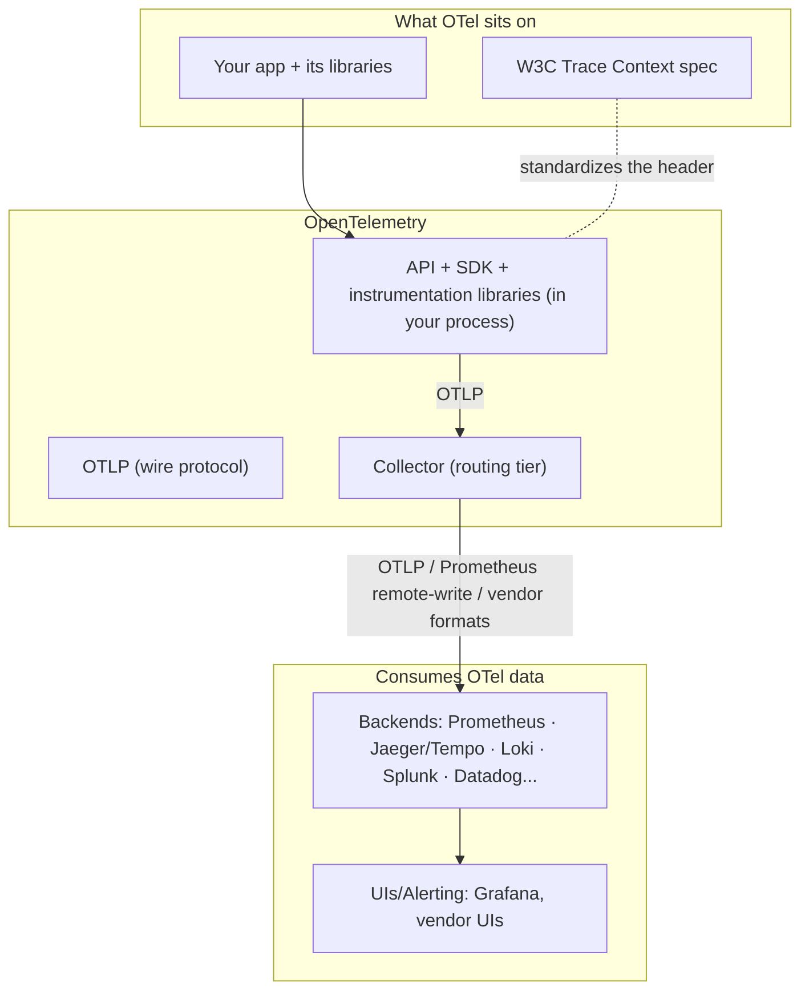

# Why OpenTelemetry Had to Exist

*Part 6 of a series on observability for microservices. Parts 1–5 treated OpenTelemetry as one box in a bigger diagram. Starting here, we open that box. [Series index](00-index.md).*

Prometheus, Jaeger, and commercial APMs were already maturing by around 2016. The part of observability that was a genuine mess was earlier in the pipeline: how telemetry got *produced* in the first place.

## Three pains, one at a time

**Pain 1 — Instrumentation lock-in.** Instrumentation is the most invasive dependency a vendor can have: it's woven through your codebase as thousands of API calls (`statsd.increment(...)`, `newrelic.startSegment(...)`, Zipkin's Brave spans...). Switching vendors meant re-instrumenting every service. Almost nobody actually did this, so vendors could price accordingly. Your own telemetry data was effectively held hostage.

**Pain 2 — The N×M matrix.** Every library author faced an impossible choice: N telemetry systems × M libraries. Should a Kafka client emit Zipkin spans? Jaeger spans? OpenCensus stats? Usually the answer was "none of the above," so the most valuable instrumentation points in any ecosystem — HTTP clients, DB drivers, message queues — stayed dark, and every company quietly re-instrumented the same libraries privately, over and over.

**Pain 3 — Siloed signals.** Metrics, logs, and traces grew up as three separate ecosystems (StatsD/Prometheus, log4j/syslog, Zipkin/Dapper-descendants), each with its own in-process context. Nothing at the production layer stamped a shared identity across all three, so correlation — "show me the logs for *this* slow trace" — required custom glue at every company, or simply didn't exist.

## What came before, and why it wasn't enough

| Predecessor | What it got right | Fatal limitation |
|---|---|---|
| Vendor SDKs / agents (New Relic, AppD...) | Deep, zero-effort auto-instrumentation | Proprietary end to end — pain 1 in its purest form |
| OpenTracing (2016) | Vendor-neutral *tracing API* | API only — no SDK, no wire format, and traces only |
| OpenCensus (Google, 2017) | API *and* SDK, traces *and* metrics | A competing standard — library authors now had to pick a side, recreating pain 2 one level up |
| Prometheus client libraries | De-facto metrics standard | Metrics only, pull-model-specific, no context propagation |

The OpenTracing/OpenCensus split was the trigger that forced the issue: two vendor-neutral standards is functionally zero standards, because library authors still had to guess which one to bet on. In 2019 they merged into **OpenTelemetry**, a CNCF project that is, by design, the only game in town — both predecessors are now officially frozen and archived.

## The four constraints that explain almost every design decision downstream

1. **The API must be free to depend on.** A library author must be able to instrument against OTel with *zero* runtime cost when no SDK is present → the **API/SDK split**, with a no-op default. (Solves pain 2.)
2. **Vendor choice must be a config change, not a code change.** → exporters are pluggable, and one wire protocol (**OTLP**) plus a routing tier (**the Collector**) sits between apps and backends. (Solves pain 1.)
3. **All signals share one context.** Traces, metrics, and logs must be producible from the same in-process context so `trace_id` lands on all of them. (Solves pain 3.)
4. **Telemetry must never take down the app.** Everything is async, buffered, and drop-on-overflow — instrumentation failures must be invisible to business logic.

If you memorize nothing else from this post, memorize this: if OpenTelemetry vanished tomorrow, you'd have to reinvent a no-op-capable facade API, a shared context carrying trace identity, a neutral wire protocol, and a routing middle tier. Those four things are exactly what the rest of this series digs into.

## What OpenTelemetry actually is

> **OpenTelemetry is a vendor-neutral observability framework — APIs, SDKs, a wire protocol (OTLP), and a routing service (the Collector) — that solves telemetry lock-in and signal silos by standardizing how traces, metrics, and logs are produced, correlated through shared context, and shipped, while leaving storage and analysis to any backend you choose.**

The boundary in that last clause is the one people misunderstand most often, so it's worth stating as a checklist of what OTel is **not**:

- **Not a backend.** No database, no query language, no dashboards, no alerting. The Collector retains data for seconds (buffers), not days — you always pair it with Prometheus, Jaeger, Tempo, Splunk, or a vendor of choice. This is deliberate: competing with backends would kill the vendor coalition that makes the standard work in the first place.
- **Not just tracing, and not "the new OpenTracing."** It's all signals, sharing one context.
- **Not an observability strategy.** It standardizes production and transport; what to collect, what SLOs to set, what to alert on remain your decisions entirely.
- **Not zero-config magic everywhere.** Auto-instrumentation is excellent in Java, .NET, Python, and Node; thinner in Go, which relies mostly on explicit library wrappers or eBPF. Business-level spans and metrics are always manual — as you saw in Part 3's `checkout` method.

## Where it sits

A quick reference for its closest neighbors:

| Neighbor | Relationship |
|---|---|
| OpenTracing / OpenCensus | Predecessors, merged into OTel, both archived — choose OTel, always |
| Prometheus client libraries | Overlapping for metrics; the OTel SDK can expose Prometheus format, and the Collector can scrape Prometheus targets — they interoperate rather than compete |
| Fluent Bit / Logstash / Vector | Overlapping for log shipping; the Collector increasingly covers this, but log-specialist shippers remain common alongside it |
| Vendor agents (AppD, Datadog...) | Historically competitors; today every major vendor accepts OTLP — the standard's biggest strategic win |
| eBPF auto-instrumentation (Beyla, Odigos...) | Emerging "zero-code" producers that *emit* OTel signals — feeders, not rivals |

The decision rule this gives you: "we produce telemetry from services and want backend freedom" → OTel applies. "We need a place to *store* telemetry" → OTel isn't that; pick a backend.

Next, we go one layer deeper: the seven concepts that make up OTel's internal design, and exactly which component owns which one.

➡️ **Next:** [Part 7 — Anatomy of a Signal: Traces, Metrics, Logs, and How They Stay Correlated](07-otel-signals-and-context.md)
