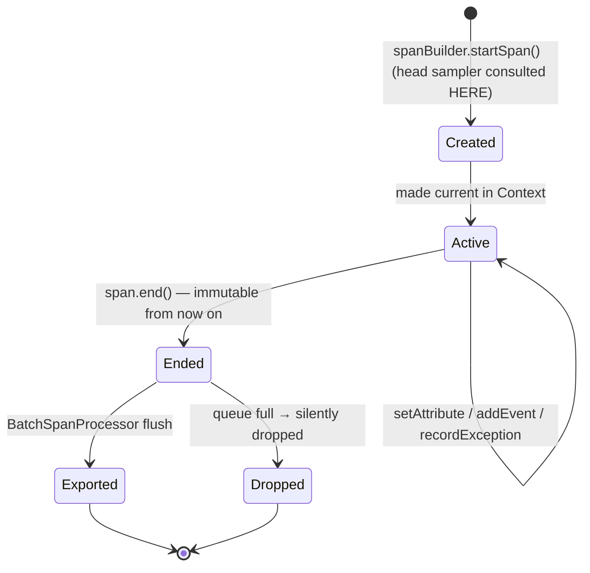
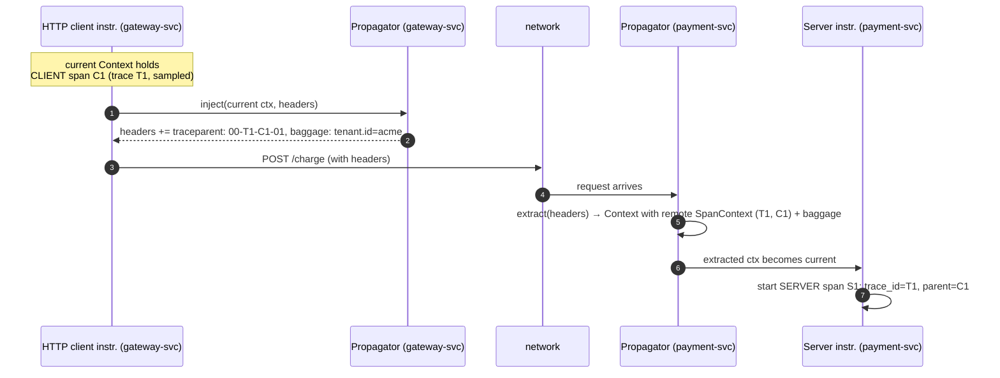

# Anatomy of a Signal: Traces, Metrics, Logs, and How They Stay Correlated

*Part 7 of a series on observability for microservices. [Part 6](06-otel-why-what.md) covered why OpenTelemetry exists. This post opens up what a span, a metric, and a log actually are inside OTel — and the exact mechanism that keeps them stitched together across a network call. [Series index](00-index.md).*

📦 GitHub: [https://github.com/geekchow/O11y-Micro-Service](https://github.com/geekchow/O11y-Micro-Service)

## The master map, briefly

Seven concepts make up OTel's internal design, each building only on the ones above it:

| # | Problem | Concept | Definition |
|---|---|---|---|
| 1 | Evidence about one request/quantity/event | **Signal** | traces, metrics, logs, baggage |
| 2 | Who emitted this? | **Resource** | immutable attributes (`service.name`, `k8s.pod.name`...) attached at SDK init |
| 3 | Instrument without forcing a vendor or runtime cost | **API/SDK split** | a no-op facade libraries depend on, plus a swappable implementation only the *application* installs |
| 4 | Signals from hop A and hop B belong to the same request | **Context & propagation** | an in-process Context plus wire-format Propagators |
| 5 | One wire format for all of it | **OTLP** | protobuf over gRPC (`:4317`) or HTTP (`:4318`) |
| 6 | Route, clean, buffer without touching app code | **Collector pipeline** | receivers → processors → exporters |
| 7 | 100% of traces is unaffordable; 1% uniformly is blind | **Sampling** | head (cheap, in the SDK) and tail (smart, in the Collector) |

This post covers #1 (signals) and #4 (context) in depth. Posts 8 and 9 cover the Collector and sampling.

## Traces — the request-shaped signal

A **trace** isn't an object that exists anywhere by itself — it's the *set of all spans sharing one trace_id*, reassembled by the backend at query time. The unit you actually create is the **span**.

### What's in a span

| Field | What it is | Notes |
|---|---|---|
| Name | Low-cardinality operation label | `GET /cart/{id}` — never `GET /cart/8817`; cardinality poisons backend grouping |
| SpanContext | `trace_id` (16 bytes) + `span_id` (8 bytes) + `trace_flags` (sampled bit) + `trace_state` | The immutable, propagatable identity — this is exactly what ends up in the `traceparent` header |
| Parent span id | Links child → parent | Empty ⇒ this is the **root span** |
| Kind | `SERVER` / `CLIENT` / `INTERNAL` / `PRODUCER` / `CONSUMER` | Lets backends infer sync RPC pairs vs async links |
| Timestamps | Nanosecond precision start/end | Duration is derived, not stored |
| Attributes | Key-value facts: `http.response.status_code`, `cart.item_count` | Use semantic-convention keys where one exists |
| Events | Timestamped point-annotations inside the span | e.g. an exception with a stack trace — a mini-log riding inside the span |
| Links | References to *other* SpanContexts | For fan-in cases: one batch-consumer span linking 50 producer traces it can't be a literal child of |
| Status | `Unset` / `Ok` / `Error` | `Error` is what tail sampling and alerting key on — set it deliberately |

The lifecycle is worth knowing cold, because it explains a common gotcha:



Everything after `span.end()` is ignored — attempting `span.setAttribute(...)` on an ended span does nothing. And sampling has to be decidable at `startSpan()` time for head samplers, which is exactly why head sampling can't know whether a trace is going to error.

## Metrics — the aggregate-shaped signal

The metrics API is built around **instruments** owned by a `Meter`. You record *measurements*; the SDK aggregates them, and a `MetricReader` exports the aggregate periodically (default every 60s). Individual measurements never leave the process — that's the entire cost advantage metrics have over traces.

The only decision that actually matters is which instrument to pick:

| Instrument | Semantics | Example | Query it enables |
|---|---|---|---|
| Counter | Monotonic sum | `orders_placed` | `rate()` |
| UpDownCounter | Sum that can fall | `active_sessions` | current value |
| Histogram | Distribution of values | `http.server.duration` | p50/p95/p99 |
| Gauge | Last value, non-additive | `cpu.temperature` | current value (summing is meaningless) |
| Observable* (async) | You register a callback; SDK reads it on each export | `jvm.memory.used` | for values you *observe*, not *count* |

Rule of thumb: counting events → Counter; timing things → Histogram; reading a level → Gauge/UpDownCounter.

Three SDK-side mechanisms worth knowing about:

- **Views** — SDK-level config that renames instruments, drops attributes (this is your cardinality-control lever), or changes histogram buckets, without touching instrumentation code. The metrics analogue of the API/SDK split.
- **Exemplars** — sampled measurement points carrying the current `trace_id`, attached to metric data. This is the mechanism behind "click the latency spike → jump to the trace" in Grafana.
- **Temporality** — cumulative (each export = total since start, Prometheus-style) vs delta (each export = change since last, Datadog-style). You mostly care about this when a counter looks wrong in a specific backend.

## Logs — the bridged signal, on purpose

Logs are handled differently from the other two, deliberately. The world already had log4j, slf4j, logback, zap, winston — OTel decided **not** to compete with any of them. There's no user-facing "log API" the way there's a `Tracer` or a `Meter`. Instead OTel defines:

1. A **LogRecord data model** — timestamp, severity, body, attributes, Resource, and crucially `trace_id` + `span_id` fields.
2. A **Logs Bridge API**, implemented by *appenders* that plug into your existing logging framework (a Logback/Log4j OTel appender), never called directly by your code.
3. The same SDK pipeline shape as spans: a `LogRecordProcessor` feeding an OTLP exporter.

The payoff: an unmodified `log.error("payment failed")` becomes a structured LogRecord that's **automatically stamped with the active span's trace_id**, because the appender reads the same in-process Context every other signal reads. That's correlation without grep-glue — no code anywhere calls `MDC.put("trace_id", ...)`.

## Baggage — the odd one out

**Baggage** is user-defined key-values propagated across hops in its own header. It's not stored telemetry — it's a distribution mechanism: put `tenant.id=acme` in at the edge, and any downstream service can read it and copy it onto *its own* spans, metrics, or logs as an attribute. Two rules cover essentially the whole topic: it rides on **every** downstream request (keep it small), and it's plaintext visible to every hop (never put secrets in it). Nothing lands in a backend from baggage alone unless some service explicitly copies it.

## The mechanism that ties it all together: Context

Correlation has two halves. The **in-process** half: the log call on line 200 has to find the span started on line 50, possibly on a different thread. The **cross-process** half: `payment-svc` has to continue `gateway-svc`'s trace.

**Context** solves the first half. It's an immutable bag of key-values — the two that matter here are the active span and the baggage. Immutability means you never mutate a Context, you derive a new one (`context.with(span)`), which is what makes it safe to share across threads. Each language pins a "current" context using whatever the runtime offers: `ThreadLocal` in Java, `contextvars` in Python, `AsyncLocalStorage` in Node, an explicit `ctx context.Context` parameter in Go (no magic storage — this is why Go instrumentation tends to be more manual).

**This is also where things quietly break.** Any time work jumps execution units *outside* the runtime's tracking — a hand-rolled thread pool, an unmanaged queue between goroutines — the symptom is orphan spans that start brand-new traces mid-request. The fix is instrumented executors (the Java agent wraps `ExecutorService` for you automatically) or manually carrying the Context object across the boundary.

**Propagators** solve the second half — the cross-process leg. A `TextMapPropagator` does exactly two things, called by instrumentation, essentially never by your own code:

- **`inject(context, carrier)`** — serializes the current SpanContext and baggage into a carrier's string pairs (HTTP headers, Kafka message headers).
- **`extract(carrier, context)`** — parses incoming headers back into a Context, so the first span created server-side becomes a *remote child* rather than a fresh root.

The default pair is **W3C Trace Context** + **W3C Baggage**. You'll still meet legacy alternatives in the wild — B3 from Zipkin, `uber-trace-id` from Jaeger — configurable via `OTEL_PROPAGATORS` when you have to interoperate.

## The bytes on the wire

```text
traceparent: 00-4bf92f3577b34da6a3ce929d0e0e4736-00f067aa0ba902b7-01
             │  │                                │                │
             │  └ trace-id (16 bytes hex)        └ parent-id      └ trace-flags
             └ version                             (= span-id       (01 = sampled)
                                                    of the caller)
tracestate:  vendor1=opaque,vendor2=opaque    ← vendor-specific baton, rarely yours to touch
baggage:     tenant.id=acme,checkout.flow=v2  ← user key-values
```

The **trace-flags sampled bit** is load-bearing: it carries the head-sampling decision downstream so every service agrees on recording the trace or not. That's the exact mechanism `ParentBased` sampling relies on — more on that in Part 9.



Through a message queue like Kafka or RabbitMQ, the dance is identical — inject into message headers — but the consumer span uses kind `CONSUMER`, and when one poll processes many messages, instrumentation uses **links** instead of a single parent.

## Failure modes worth memorizing

| Symptom | Cause |
|---|---|
| Traces "cut" at one service — downstream spans start fresh traces | That service strips unknown headers (old proxies!), or its instrumentation has no propagator configured |
| Two teams' traces don't join | Propagator mismatch — one side B3, the other W3C. Align `OTEL_PROPAGATORS` |
| Orphan spans mid-service | Context lost crossing an untracked thread pool or async boundary |
| A rogue client dictates your sampling | You're honoring inbound `traceparent` sampled-flags from the public internet — extraction at the edge should start a *new* root, or re-decide |

Given any `traceparent` string, you should now be able to name every field. Given a broken trace, you should be able to say which half — in-process or cross-process — failed, and where to look.

Next: everything that happens once telemetry leaves the process — the Collector.

➡️ **Next:** [Part 8 — Inside the Collector: Pipelines, Deployment Patterns, and Failure Modes](08-otel-collector.md)
