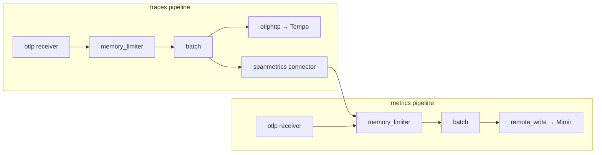
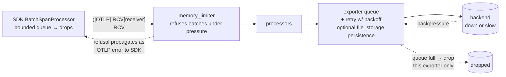

# Inside the Collector: Pipelines, Deployment Patterns, and Failure Modes

*Part 8 of a series on observability for microservices. [Part 7](07-otel-signals-and-context.md) covered signals and context propagation. This post covers the piece that moves telemetry once it leaves your process: the OpenTelemetry Collector. [Series index](00-index.md).*

## What it is, in one line

The Collector is a single Go binary that runs configurable `receivers → processors → exporters` **pipelines** — the vendor-agnostic middle tier that lets apps offload telemetry fast and lets backends become a config choice instead of a code change.

Could your app export straight to a backend, skipping the Collector entirely? Yes — for local dev or a tiny setup, that's fine. Production wants the middle tier because it centralizes everything you must *not* scatter across fifty services: retries, batching, credentials, PII scrubbing, sampling policy, and vendor routing.

## The five component types

| Type | Role | Workhorses you'll actually use |
|---|---|---|
| Receivers | Data in (listen or scrape) | `otlp` (gRPC `:4317` / HTTP `:4318`); `prometheus` (scrapes targets!), `filelog` (tails files), `jaeger`, `kafka`, `hostmetrics` |
| Processors | Transform in flight | `memory_limiter` (always first), `batch` (always ~last), `attributes`/`resource` (add/drop/rename), `filter`, `transform` (OTTL language), `k8sattributes` (pod metadata enrichment), `tail_sampling` |
| Exporters | Data out, with retry + persistent queue | `otlp`/`otlphttp`, `prometheusremotewrite`, `debug` (to console), vendor exporters (`splunk_hec`, `datadog`...) |
| Connectors | Exporter of pipeline A **and** receiver of pipeline B | `spanmetrics` (spans → RED metrics), `servicegraph`, `forward` |
| Extensions | Side services, touch no telemetry | `health_check`, `pprof`, `zpages` (live pipeline debugging) |

## Config anatomy: define, then wire

The config has two halves, and the second half is the one people forget: **defining a component does nothing until a pipeline references it.**

```yaml
receivers:
  otlp:
    protocols: { grpc: {}, http: {} }
processors:
  memory_limiter: { check_interval: 1s, limit_percentage: 80 }
  batch: {}
exporters:
  otlphttp/tempo: { endpoint: http://tempo:4318 }
  prometheusremotewrite: { endpoint: http://mimir:9009/api/v1/push }
connectors:
  spanmetrics: {}

service:
  pipelines:
    traces:
      receivers: [otlp]
      processors: [memory_limiter, batch]
      exporters: [otlphttp/tempo, spanmetrics]   # fan-out: both get every batch
    metrics:
      receivers: [otlp, spanmetrics]             # ← connector re-enters here
      processors: [memory_limiter, batch]
      exporters: [prometheusremotewrite]
```



Three rules of thumb worth internalizing: `memory_limiter` goes first (refuse before you swell), `batch` goes last before exporters (compress the network), and one pipeline per signal type — with the `name/instance` syntax (`otlphttp/tempo`) when you need multiple instances of one component type, exactly as the config above does.

On **distributions**: the same engine ships in flavors — **core** (minimal, curated), **contrib** (~everything; this is where `tail_sampling`, `k8sattributes`, and vendor exporters live, and the usual choice), **k8s**, and **otlp-only**. For production hardening, build a custom binary containing only the components you actually use with the **OpenTelemetry Collector Builder (`ocb`)**. Component maturity varies individually per component — check each one's README, not just the distribution as a whole.

## A real gateway config, annotated

Here's the tail-sampling gateway Collector from the companion stack, with the parts that trip people up called out:

```yaml
connectors:
  spanmetrics:
    namespace: traces.span.metrics
    exemplars:
      enabled: true

processors:
  memory_limiter:
    check_interval: 1s
    limit_mib: 256
    spike_limit_mib: 64
  batch: {}
  tail_sampling:
    decision_wait: 10s
    num_traces: 20000
    policies:
      - name: errors
        type: status_code
        status_code: { status_codes: [ERROR] }
      - name: slow
        type: latency
        latency: { threshold_ms: 2000 }
      - name: baseline
        type: probabilistic
        probabilistic: { sampling_percentage: 25 }

service:
  pipelines:
    traces:                       # the culled stream → Tempo
      receivers: [otlp]
      processors: [memory_limiter, tail_sampling, batch]
      exporters: [otlp/tempo]
    traces/spanmetrics:           # the UNCUT stream → RED metrics
      receivers: [otlp]
      processors: [memory_limiter, batch]
      exporters: [spanmetrics]
```

That second pipeline — `traces/spanmetrics` — is not an accident or duplication. It reads the *same* incoming OTLP spans as the `traces` pipeline but skips `tail_sampling` entirely, because RED metrics need to see every request, not just the ones tail sampling decided to keep. Get this ordering backwards — run `spanmetrics` after sampling — and your dashboard's error rate silently understates reality by whatever fraction tail sampling discarded.

## Deployment patterns — the decision that actually matters

| Pattern | Topology | Choose when |
|---|---|---|
| No collector | SDK → backend directly | Dev, demos, tiny setups |
| Agent | SDK → Collector on the same node (DaemonSet/sidecar) → backend | Default production baseline: apps offload in microseconds, agent adds node/pod metadata no central box could know |
| Gateway | SDKs/agents → load-balanced central Collector tier → backends | You need fleet-wide policy in one place: tail sampling, PII scrubbing, egress credentials, per-vendor routing |
| Agent + gateway | Both | The common end-state at scale |

The trade is locality vs centrality: agents know *node* things and sit near the app; gateways see *whole traces* and hold one copy of policy and secrets. Tail sampling forces a gateway tier by definition — a per-node agent can never see all the spans of a distributed trace, since those spans originate on different nodes. Part 9 covers the routing trick this requires when you scale the gateway tier past a single instance.

## Failure modes — how the pipeline sheds load

The Collector pipeline is a chain of queues, and it's worth knowing exactly how each link fails:



- **Backend down:** that exporter's queue absorbs the burst, retries with backoff, and eventually drops — but *other* exporters in the same fan-out keep flowing normally. This is per-backend blast-radius isolation. Add the `file_storage` extension for a queue that survives a Collector restart.
- **Collector overwhelmed:** `memory_limiter` starts refusing incoming batches; the refusal propagates back as an OTLP error to the SDK; the SDK's own queue fills and drops at the source. Every stage degrades gracefully rather than blocking the application thread or OOM-killing the Collector.
- **Collector down entirely:** the SDK retries briefly, then drops. This is exactly why the agent tier runs on-node — there's almost nothing to lose on that first hop — and why the Collector's own `health_check` and internal metrics feed back into Prometheus. It's the "watcher's watcher" pattern applied to the observability pipeline itself.

Given any Collector YAML, you should now be able to draw its pipelines on a whiteboard, argue agent-vs-gateway for a given org's needs, and, for any failure scenario ("Splunk ingest is lagging"), say exactly which queue fills and what gets dropped.

Next: the policy that the gateway tier exists to run — sampling.

➡️ **Next:** [Part 9 — Sampling: Keeping the Interesting 1%](09-otel-sampling.md)
