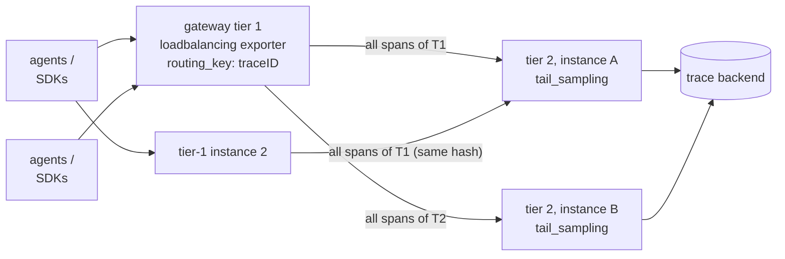

# Sampling: Keeping the Interesting 1%

*Part 9 of a series on observability for microservices. [Part 8](08-otel-collector.md) covered the Collector's pipeline mechanics. This post covers the policy that the gateway tier exists to run: deciding which traces are worth keeping. [Series index](00-index.md).*

## Whether to sample at all

Sampling exists because trace *volume* scales with traffic while trace *value* doesn't. At 1,000+ traces/sec, the millionth healthy `GET /health` teaches you nothing the first thousand didn't already show you. Sample when volume is high, most traffic is healthy, and errors or latency have identifiable signatures. Don't sample when volume is tiny, or when regulation forbids dropping data outright.

One thing worth remembering from Part 7: **aggregates come from metrics, not from stored traces.** Sampling traces thins your per-request evidence — it doesn't blind your dashboards, because RED metrics (as built in Part 8's `spanmetrics` connector) are computed from the unsampled stream.

## Head sampling — decide at birth

The decision happens in the **SDK**, at `startSpan()` on the root span, with only what's knowable at that exact instant. That's why it's cheap, and it's also why it structurally can't know whether this particular trace is about to error.

| Sampler | Decision rule |
|---|---|
| `AlwaysOn` / `AlwaysOff` | Everything / nothing |
| `TraceIdRatioBased(0.10)` | Keep if a deterministic function of the *trace_id* falls under 10% — same trace_id ⇒ same verdict everywhere ("consistent probability sampling") |
| `ParentBased(root=...)` | **The default wrapper**: if there's a parent, obey its `traceparent` sampled flag; only root spans consult the delegate sampler |

`ParentBased(TraceIdRatioBased(0.10))` — set via:

```bash
OTEL_TRACES_SAMPLER=parentbased_traceidratio
OTEL_TRACES_SAMPLER_ARG=0.1
```

— is the canonical production head-sampling config, and it shows the mechanism cooperating with what Part 7 covered: the *root* service rolls the dice exactly once, and the decision rides the `traceparent` flags bit to every downstream service. Traces are always kept or dropped **whole** this way. A downstream service sampling independently, without honoring the parent's flag, would produce Swiss-cheese traces with random gaps.

**The blindness is structural, not a bug.** At decision time, the error hasn't happened yet. At 10% head sampling, you keep roughly 10% of your error traces too — 90% of your incident evidence, gone, before the request even finished. Fixing that requires deciding *after* the trace completes.

## Tail sampling — decide after the whole trace is seen

The Collector's `tail_sampling` processor (from the contrib distribution) buffers spans by `trace_id`, waits `decision_wait` seconds after a trace goes quiet, then runs policies over the *complete* trace:

```yaml
processors:
  tail_sampling:
    decision_wait: 10s          # buffer window per trace
    num_traces: 100000          # max traces held in memory
    policies:
      - name: keep-all-errors
        type: status_code
        status_code: { status_codes: [ERROR] }
      - name: keep-slow
        type: latency
        latency: { threshold_ms: 2000 }
      - name: keep-1pct-of-the-rest
        type: probabilistic
        probabilistic: { sampling_percentage: 1 }
```

Policies OR together — any match keeps the trace. `and`/`composite` policy types build richer logic (e.g., "10% of checkout traces, 1% of everything else, capped at N spans/sec" via `rate_limiting`). The result is close to the observability ideal: **100% of errors and slow traces, ~1% of boring ones** — full diagnostic power at a fraction of the storage bill, with the mechanism now fully visible.

## The catch: tail sampling is a distributed-systems commitment

To judge a *complete* trace, **every span of that trace must reach the same Collector instance.** A naive load-balanced gateway pool with round-robin routing silently breaks this — fragments of one trace land on different instances, and each instance's policies judge only a partial trace. The fix is a two-tier gateway, where tier 1 runs the `loadbalancing` exporter, routing by `trace_id`:



Every span of trace T1 converges on one tail-sampler because tier 1 hashes the trace_id to pick which tier-2 instance receives it. The honest costs, worth stating plainly: stateful, RAM-hungry Collectors (memory scales with `num_traces × avg trace size`), `decision_wait` adds latency before export, re-sharding wobble whenever you scale tier 2 (brief judgment errors on in-flight traces), and a tier-2 crash loses whatever traces it had buffered but not yet decided on. Several vendors sell managed versions of exactly this box, because it's genuinely non-trivial to run well.

## Two integration caveats that bite people

- **Run `spanmetrics` before `tail_sampling` in the pipeline order**, as shown in Part 8, or your span-derived RED metrics will reflect post-sampling — and therefore wrong — rates.
- **Tail-kept data is deliberately not statistically representative.** "100% of errors + 1% of the rest" is fantastic for debugging but means naive math like `error_rate = errors / total` over *stored* traces is meaningless — the denominator is wrong. The `probabilistic` policy records the sampling probability alongside each kept trace, so backends that understand it can re-weight counts correctly. If you need accurate rates, that's what the unsampled `spanmetrics` pipeline is for, not the trace store.

## Choosing, in practice

| Situation | Strategy |
|---|---|
| Dev / low volume | No sampling (`AlwaysOn`, the default) |
| High volume, cost-driven, simple | Head only: `ParentBased(TraceIdRatioBased)` — one env var, done |
| High volume, must never miss an error trace | Tail sampling at a gateway tier — accept the operational cost |
| Realistic large system | **Both**: a modest head rate (e.g. 25%) caps SDK and network cost; tail policies concentrate the survivors on errors and latency |

You should now be able to explain why `ParentBased` needs the `traceparent` flags bit, why tail sampling forces trace-id-routed two-tier gateways, and why head and tail sampling compose rather than compete — they gate two different costs: production cost (head) versus retention cost (tail).

The last post in this series runs every concept from Parts 6–9 through one real request, atom by atom, end to end.

➡️ **Next:** [Part 10 — One Checkout Request, Atom by Atom](10-otel-walkthrough.md)
