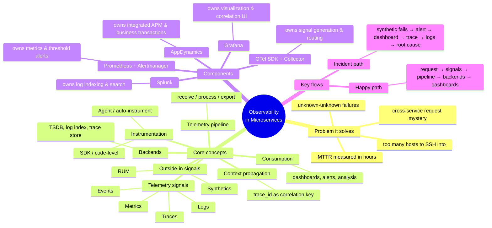

# Observability for Modern Microservices — Guide Overview

> **Where you are:** **stage 1 (concepts)** of the [learning path](../../README.md) — the entry point of the whole journey.
> **What you'll know after this file:** the whole territory in one glance — every concept, every tool, and how the files ahead are organized.

This guide explains **observability** for microservice applications — monitoring, alerting, logging, tracing, APM, synthetics, and RUM — and demonstrates how five real tools cooperate to deliver it:

| Tool | Role in this guide |
|---|---|
| **OpenTelemetry (OTel)** | The vendor-neutral *instrumentation + pipeline* standard |
| **Prometheus** | The *metrics* backend + threshold alerting |
| **Grafana** | The *visualization + unified alerting* front-end |
| **Splunk** | The *log analytics* backend (+ Splunk Observability Cloud for APM/RUM/Synthetics) |
| **AppDynamics** | The *integrated commercial APM suite* — the "buy" alternative to the composable stack |

## The whole territory in one mindmap

## Reading order

| File | Stage | Question it answers |
|---|---|---|
| [01-why.md](01-why.md) | WHY | What pain forced observability into existence? |
| [02-what.md](02-what.md) | WHAT | What exactly is observability, and where does each tool sit? |
| [03-how.md](03-how.md) | HOW | How do concepts, components, and flows fit together? *(the heart)* |
| [04-walkthrough.md](04-walkthrough.md) | WALKTHROUGH | One checkout-latency incident, traced end to end through all five tools |
| [05-next-steps.md](05-next-steps.md) | — | Exercises and further reading |

## Continuing the path

When this pack is done, the concepts become concrete and then deep:

| Next stage | Where | What it adds |
|---|---|---|
| **2 · Example** | [stack/](../../stack/README.md) *(run it)* + [02-example/](../02-example/00-overview.md) *(tour it)* | Everything above as a live docker-compose system — including a one-knob reproduction of this pack's [04-walkthrough](04-walkthrough.md) incident |
| **3 · Depth** | [03-deep-dives/](../03-deep-dives/README.md) | Each key player opened up on its own; [otel/](../03-deep-dives/otel/00-overview.md) is ready today |

➡ **Next:** [01-why.md](01-why.md)
