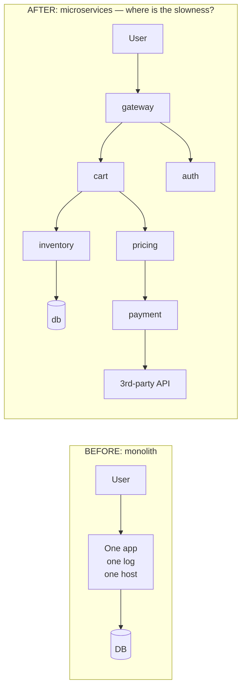

# Stage 1 — WHY: The problem observability solves

> **Where you are:** Stage 1 of 4.
> **What you'll know after this file:** why traditional monitoring collapsed under microservices, and what constraints shaped the modern observability stack.

## 1. The world before: monitoring a monolith

In the monolith era, "monitoring" meant a small, known checklist:

- One (or few) servers → check CPU, memory, disk with Nagios/Zabbix.
- One process → tail one log file on one machine.
- One call stack → a slow request could be profiled *in place*.

You knew in advance what could go wrong, so you wrote a check for each known failure mode. This is **monitoring: asking questions you already knew to ask.**

## 2. What microservices broke

Split that monolith into 40 services × N replicas, deployed on ephemeral containers, and every assumption dies:

| Monolith assumption | Microservices reality | Concrete pain |
|---|---|---|
| One log file | Thousands of log streams on containers that vanish after crashes | You can't `ssh + grep`; the evidence is gone with the pod |
| One call stack | A single user request hops 8–15 services | "Checkout is slow" — but *which* of the 12 hops is slow? Nobody can say |
| Known failure modes | Emergent, novel failures (retry storms, partial outages, noisy neighbors) | You can't pre-write a check for a failure you've never imagined |
| Host-centric health | A host can be healthy while the *user experience* is broken | All dashboards green, customers screaming |
| Slow release cadence | Deploys many times per day | "What changed?" has 30 answers per hour |

*Caption: the same "checkout is slow" complaint, before vs after — the after-picture has no single place to look.*

## 3. Why existing solutions weren't enough

1. **Host monitoring (Nagios-style checks):** answers "is the server up?", not "why is *this user's request* slow across 12 services?" It only detects **known-unknowns**.
2. **Log files + grep:** logs still exist, but they're scattered, ephemeral, and — critically — **uncorrelated**: nothing links service A's log line to service B's log line for the same request.
3. **First-generation APM (per-vendor agents):** tools like early AppDynamics/New Relic solved deep visibility, but each with a **proprietary agent and data format** — instrument once, locked in forever; and mixing vendors across teams meant telemetry that couldn't be joined.
4. **Metrics-only stacks:** metrics tell you *that* p99 latency spiked (cheap, aggregatable), but aggregation destroys the per-request detail needed to answer *why*.

## 4. Constraints that shaped the modern stack

- **Cardinality & cost:** you cannot store everything about every request; hence *cheap aggregates (metrics) for detection, expensive detail (traces/logs) for diagnosis, sampling in between*.
- **Correlation:** signals are useless in isolation; hence a *shared correlation key (trace context)* propagated across every hop.
- **Vendor neutrality:** teams refused to re-instrument per vendor; hence a *standard* (OpenTelemetry) separating signal generation from signal storage.
- **Outside-in truth:** server-side telemetry can't see a broken CDN or a JS error; hence *synthetics and RUM* measuring from the user's side.

**The punchline:** monitoring = watching for failures you predicted. **Observability = being able to ask arbitrary new questions of a running system — from its outputs — without shipping new code.** Under microservices, the second is not a luxury; if it didn't exist, you'd have to invent it.

➡ **Next:** [02-what.md](02-what.md) — the precise definition, boundaries, and where each tool sits.
