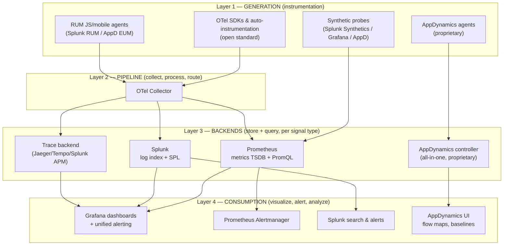

# Stage 2 — WHAT: Definition, boundaries, and the tool ecosystem

> **Where you are:** Stage 2 of 4. You know the pain ([Stage 1](01-why.md)).
> **What you'll know after this file:** what observability *is* and *is not*, what each sub-discipline (monitoring, alerting, tracing, APM, synthetics, RUM) means, and exactly where OTel, Prometheus, Grafana, Splunk, and AppDynamics sit relative to each other.

## 1. One-sentence definition

> **Observability** is a property of a system — achieved through a telemetry pipeline — that lets engineers answer *arbitrary, previously-unasked questions* about cross-service behavior ([the Stage-1 problem](01-why.md)) by emitting, correlating, and analyzing **metrics, logs, and traces**.

The sub-disciplines are *practices built on top of* that property:

| Term | One-line meaning | Direction |
|---|---|---|
| **Monitoring** | Continuously evaluating known health signals (mostly metrics) against expectations | inside-out, passive |
| **Alerting** | Turning a signal crossing a threshold/anomaly into a routed human notification | inside-out, passive |
| **Logging** | Recording discrete, richly-detailed events for after-the-fact search | inside-out, passive |
| **Tracing** | Reconstructing one request's full journey across services as a tree of timed spans | inside-out, passive |
| **APM** | An opinionated *bundle* of the above, application-centric: transactions, code-level timing, baselines | inside-out, passive |
| **Synthetics** | Robots running scripted user journeys from outside, 24/7, even with zero traffic | **outside-in, active** |
| **RUM** (Real User Monitoring) | Telemetry from *real users' browsers/apps*: page load, JS errors, Core Web Vitals | **outside-in, passive** |

## 2. Boundaries — what observability is *not*

- **Not just "monitoring, renamed."** Monitoring answers pre-defined questions; observability lets you ask new ones. Monitoring is a *subset*.
- **Not a tool you install.** Buying Splunk or AppDynamics does not make a system observable; uninstrumented code emits nothing worth analyzing.
- **Not debugging or profiling.** It narrows *where* and *why at the system level*; a CPU profiler and a debugger still take over for line-level root cause.
- **Deliberately does not store everything.** Sampling and aggregation are features, not bugs — full-fidelity capture of every request is economically impossible at scale.

## 3. Position in the ecosystem — where each tool sits

The five tools are **not five competitors**. They occupy different layers of one pipeline — with two of them (Splunk Observability Cloud, AppDynamics) also offering vertically-integrated shortcuts through all layers.

*Caption: who sits on top of whom — OTel feeds signal-specific backends; Grafana reads them all; AppDynamics is a vertical slice through every layer with its own agent, backend, and UI.*

**One line on each relationship:**

- **OTel vs everything:** OTel *generates and routes* telemetry; it stores and visualizes nothing. It is the plumbing all others can drink from.
- **Prometheus vs Splunk:** not competitors — Prometheus owns *metrics* (cheap numeric time series, pull-scraped), Splunk owns *logs* (expensive rich events, pushed and indexed). You typically run both.
- **Grafana vs Prometheus/Splunk:** Grafana stores no telemetry; it is the single pane of glass *querying* Prometheus, Splunk, and trace backends side by side.
- **AppDynamics vs the rest:** the "buy the integrated suite" philosophy vs "compose open pieces." AppD bundles agent + backend + UI + APM analytics (business transactions, automatic baselining) in one product — faster to value, less flexible, license cost.
- **Splunk the company, twice:** classic **Splunk Enterprise** = log analytics; **Splunk Observability Cloud** = an OTel-native APM/RUM/Synthetics suite (competing with AppDynamics). This guide uses Splunk primarily in its log-analytics role and mentions the O11y Cloud where relevant.

**Build-vs-buy in one table:**

| | Composable stack | Integrated suite |
|---|---|---|
| Tools | OTel + Prometheus + Grafana + Splunk(logs) | AppDynamics (or Splunk O11y Cloud) |
| Instrumentation | Open standard, vendor-neutral | Proprietary agent, auto-everything |
| Strength | No lock-in, best-of-breed, cheap at scale | Time-to-value, business-transaction analytics, one vendor to call |
| Cost | Engineering time | License fees |

➡ **Next:** [03-how.md](03-how.md) — the heart: concepts, component responsibilities, and how they coordinate.
