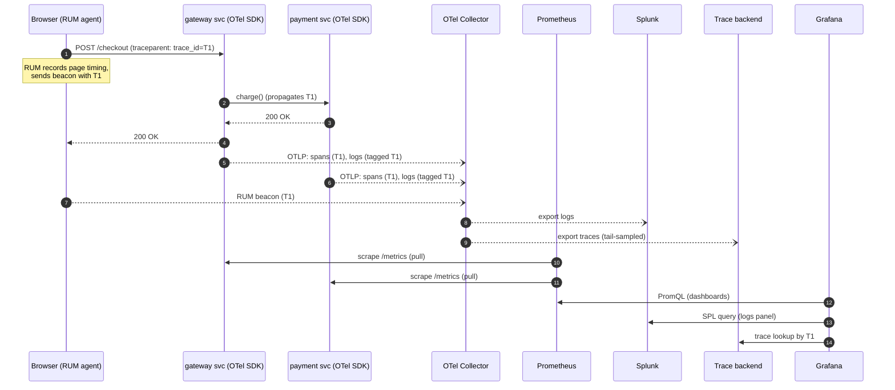
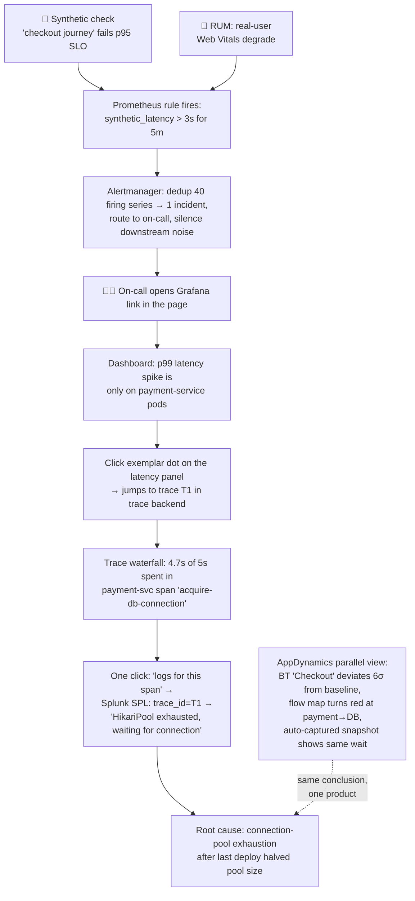

# Stage 3 — HOW: Concepts, components, and coordination (the heart)

> **Where you are:** Stage 3 of 4. You know the problem ([01](01-why.md)) and the definitions/positioning ([02](02-what.md)).
> **What you'll know after this file:** the 7 core concepts, exactly what each tool owns / knows / deliberately does *not* do, and the end-to-end flows — happy path and incident path — that make them one system.

---

## 3.1 Domain mapping — from problem to concepts

Seven concepts, in dependency order (each builds only on the ones above it):

| # | Real-world problem element | Concept | One-line definition & why this abstraction |
|---|---|---|---|
| 1 | "Evidence a system emits about itself" | **Telemetry signal** | Any exported observation. Split by cost/fidelity trade-off into three types: **metric** (cheap pre-aggregated number: `http_requests_total`), **log** (rich discrete event: a stack trace), **trace** (a tree of timed **spans** reconstructing one request's journey). No single type suffices — the split *is* the design. |
| 2 | "Code has to actually emit signals" | **Instrumentation** | The code/agent producing signals. Two styles: **SDK/manual** (you call the API — precise, laborious) and **auto/agent** (bytecode or eBPF injection — zero code change, the AppDynamics specialty and OTel's `javaagent` mode). |
| 3 | "Link service A's signals to service B's, for the same request" | **Context propagation** | A **trace_id + span_id** carried in a request header (W3C `traceparent`) across every hop, and stamped onto metrics (exemplars) and logs. This is *the* correlation key — without it observability degenerates into three disconnected silos. |
| 4 | "Ship signals out without coupling every app to every backend" | **Telemetry pipeline** | A middle tier that *receives* (OTLP/other protocols), *processes* (batch, filter, redact, **sample**), and *exports* to backends. Decouples generation from storage: change vendors by editing one config, not every service. |
| 5 | "Store each signal type the way it's queried" | **Backend** | Signal-specialized storage: a **TSDB** for metrics (Prometheus), an **inverted index** for logs (Splunk), a **trace store** keyed by trace_id (Jaeger/Tempo/Splunk APM). One-size-fits-all storage fails on cost or query speed. |
| 6 | "Humans must detect and diagnose" | **Consumption** | Dashboards (visual patterns), **alerts** (signal → routed notification, with dedup/silencing so 200 pod failures ≠ 200 pages), and analysis UIs (trace waterfalls, log search, APM flow maps). |
| 7 | "Server-side telemetry can't see what users see" | **Outside-in signals** | **Synthetics** (scripted robot journeys, run 24/7 even at zero traffic — catches outages *before* users) and **RUM** (real browsers reporting load times, JS errors, Web Vitals). They close the loop the first six concepts can't. |

Everything else you'll meet in vendor docs (SLOs, error budgets, exemplars, business transactions, baselining…) is **derived** from these seven.

---

## 3.2 Responsibility assignment — from concepts to components

The elegance of the composable stack is that each tool refuses to do the others' jobs:

| Component | **Owns** (single responsibility) | **Knows** | **Deliberately does NOT do** |
|---|---|---|---|
| **OTel SDK / auto-instr.** | Generating vendor-neutral signals *and propagating trace context* (concepts 1–3) | The app's internals: spans in flight, current trace_id | Store, query, visualize, alert — nothing. Emits and forgets |
| **OTel Collector** | The pipeline (concept 4): receive → process (batch, redact, tail-sample) → fan out | Routing config; which exporter gets which signal | Analyze or alert; retain data beyond a buffer. It's plumbing, proudly |
| **Prometheus** | Metrics backend (concept 5): scrape `/metrics` by *pull*, store in TSDB, answer PromQL, evaluate alert *rules* | Every time series (labels → samples); which targets to scrape (service discovery) | Logs or traces; per-request detail; long-term/high-cardinality storage; alert *routing* |
| **Alertmanager** | Alert delivery (concept 6b): dedup, group, silence, route to PagerDuty/Slack | Active alerts, silences, on-call routes | Decide *when* to alert — that's Prometheus's rules; it only handles firing alerts |
| **Splunk (Enterprise)** | Log backend (concept 5): ingest → index → search (SPL), any schema, after the fact | Every indexed event, searchable by anything — including `trace_id` | Numeric time-series efficiency (it *can*, but at ~10–100× the cost of a TSDB); distributed trace reconstruction (core product) |
| **Grafana** | The correlation surface (concept 6a): dashboards querying *all* backends side by side; unified alerting; **pivot links** metric→trace→log | Dashboard definitions and datasource connections — *no telemetry* | Store any signal; instrument anything. If Grafana dies, your data is intact |
| **AppDynamics** | Integrated APM (concepts 1–6 in one box): proprietary agents auto-discover **Business Transactions** ("Checkout"), baseline them statistically, alert on deviation, drill to code level; EUM adds RUM/synthetics | Transaction topology (flow map), historical baselines, code-level snapshots | Open interchange (agents feed only its controller — improving via OTel support, but the model is closed); deep log analytics (typically forwards to Splunk); infra metrics at Prometheus's granularity/price |

> **The design insight:** the composable stack achieves what AppDynamics ships in one product, by *composing single-responsibility parts around one shared key — the trace context*. AppD's bet is the opposite: correlation is easiest when one vendor controls agent, store, and UI. Both bets are rational; that's why both survive.

---

## 3.3 Coordination — how they work together

### Flow A — the happy path: one request becomes telemetry everywhere

*Caption: how one checkout request fans out into metrics, logs, traces, and RUM data — all stitched by trace_id `T1`. Note the asymmetry: everything is **pushed** to the Collector except metrics, which Prometheus **pulls**.*

Three coordination rules make this work:

1. **Push vs pull:** logs/traces/RUM are pushed (events happen once — miss them and they're gone); metrics are pulled by Prometheus (state is re-readable, and pull gives Prometheus service discovery + an automatic "is it up?" signal per scrape).
2. **The trace_id is stamped on everything:** spans carry it natively, log lines get it injected by the OTel SDK, metrics carry sampled *exemplars* pointing to it. This single decision is what lets Grafana offer one-click metric→trace→log pivots.
3. **Sampling happens in the Collector,** not the app: *tail-based sampling* keeps 100% of erroring/slow traces and ~1% of boring ones — you keep diagnostic power at 1% of the storage bill. (AppDynamics does the equivalent internally: it always keeps "snapshots" of slow/error transactions.)

### Flow B — the incident path: outside-in detection to root cause

This is *why* the design looks the way it does — the failure flow the whole stack is built to shorten:

*Caption: the diagnostic funnel — synthetics/RUM detect (outside-in), metrics localize (which service), traces isolate (which hop), logs explain (why). Each layer hands the trace_id to the next.*

### Flow C — coordination under failure of the observability stack itself

Two edge cases justify further design choices:

- **Collector dies:** SDKs buffer briefly and drop — apps never block on telemetry (observability must not take down what it observes). Deploy Collectors as a per-node agent + load-balanced gateway tier for HA.
- **A backend dies (e.g., Splunk ingest lags):** the Collector's per-exporter queues absorb bursts and drop *only that signal type*; metrics and traces keep flowing. Signal-type isolation (concept 5) is also a *blast-radius* decision, not just a cost one.
- **The "watcher's watcher":** Prometheus alerts on the Collector's and its own health (`up == 0`), and an *external* synthetic (or a second Prometheus) watches Prometheus — the outside-in concept applied recursively.

**Quality bar check:** you should now be able to whiteboard: OTel instruments and propagates → Collector routes and samples → Prometheus/Splunk/trace-store each store their signal → Grafana correlates and alerts via trace_id pivots → synthetics/RUM watch from outside → AppDynamics as the integrated alternative slice. Every box exists because of a Stage-1 pain.

➡ **Next:** [04-walkthrough.md](04-walkthrough.md) — the whole machine, run once, on a concrete checkout incident.
