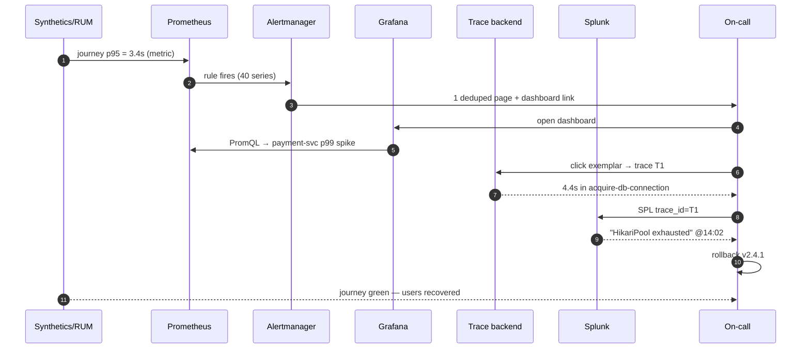

# Stage 4 — WALKTHROUGH: "Checkout is slow" — one incident, every tool

> **Where you are:** Stage 4 of 4. You have the full mental model from [03-how.md](03-how.md).
> **What you'll know after this file:** every concept and component from Stage 3, *seen doing its job once*, on a realistic timeline — with real config and query artifacts.

**The scene:** an e-commerce app — `gateway → cart → payment → Postgres`, plus `auth` and `inventory`. Tuesday 14:02, a deploy ships `payment-service v2.4.1`, which accidentally halves the DB connection pool from 20 to 10. Traffic is moderate. Here is the next 25 minutes.

---

## T–0 (before the incident): the standing setup

Every service runs the **OTel** Java agent (**instrumentation**, zero code change):

```bash
java -javaagent:opentelemetry-javaagent.jar \
  -Dotel.service.name=payment-service \
  -Dotel.exporter.otlp.endpoint=http://otel-collector:4317 \
  -jar payment.jar
```

The **OTel Collector** (**telemetry pipeline**) routes each **signal** to its **backend** — one config, three destinations:

```yaml
receivers:  { otlp: { protocols: { grpc: {} } } }
processors:
  batch: {}
  tail_sampling:            # keep all slow/error traces, 1% of the rest
    policies:
      - { name: errors,  type: status_code, status_code: {status_codes: [ERROR]} }
      - { name: slow,    type: latency,     latency: {threshold_ms: 2000} }
      - { name: sample,  type: probabilistic, probabilistic: {sampling_percentage: 1} }
exporters:
  prometheusremotewrite: { endpoint: http://prometheus:9090/api/v1/write }
  splunk_hec:            { endpoint: https://splunk:8088, token: ${HEC_TOKEN} }
  otlp/traces:           { endpoint: http://tempo:4317 }
service:
  pipelines:
    metrics: { receivers: [otlp], processors: [batch], exporters: [prometheusremotewrite] }
    logs:    { receivers: [otlp], processors: [batch], exporters: [splunk_hec] }
    traces:  { receivers: [otlp], processors: [tail_sampling, batch], exporters: [otlp/traces] }
```

A **synthetic** browser check (Splunk Synthetics) runs the full checkout journey every minute from 3 regions; the **RUM** JS snippet in the storefront reports real-user timings. A **Prometheus** alert *rule* watches the SLO; **Alertmanager** owns routing. In parallel, **AppDynamics** agents (installed on the same JVMs for the payments team) have spent weeks learning the **Business Transaction** "Checkout" baseline: p95 = 800 ms ± σ.

## T+0 — 14:02: the deploy

`payment-service v2.4.1` rolls out. Pool size: 20 → 10. Nothing is red yet.

## T+4 — 14:06: outside-in detection fires first

Under afternoon load, connections queue. The **synthetic** check's checkout step breaches 3 s; **RUM** shows real-user "time to order confirmation" p75 climbing. The synthetic exporter's metric trips this **Prometheus rule**:

```yaml
- alert: CheckoutSyntheticSlow
  expr: synthetic_journey_duration_seconds{journey="checkout", quantile="0.95"} > 3
  for: 3m
  labels: { severity: page, team: payments }
  annotations:
    summary: "Checkout synthetic p95 {{ $value }}s (SLO 3s)"
    dashboard: "https://grafana/d/checkout-slo"
```

## T+7 — 14:09: alerting, deduplicated

Forty per-region/per-quantile series are now firing. **Alertmanager** groups them into **one** page (its *owns*: dedup/group/route — not deciding when):

```yaml
route:
  group_by: [alertname, team]
  group_wait: 30s
  receiver: pagerduty-payments
```

The on-call engineer gets a single PagerDuty page with the Grafana link.

## T+9 — 14:11: localize with metrics (Grafana + Prometheus)

In **Grafana** (**consumption** — querying, storing nothing), the checkout dashboard shows the classic RED panels. This PromQL localizes the spike to one service:

```promql
histogram_quantile(0.99,
  sum by (service, le) (rate(http_server_duration_seconds_bucket[5m])))
```

Only `payment-service` has p99 jumping 300 ms → 4.8 s — and the deployment-annotation line at 14:02 sits right at the knee of the curve. *Which service* is answered; *why* is not — metrics aggregated away the detail, by design.

## T+11 — 14:13: isolate with a trace (context propagation pays off)

The latency panel shows **exemplar** dots — sampled trace_ids stamped onto the metric. One click on a 4.9 s dot opens trace `T1=4bf92f35…` in the trace backend, kept by the Collector's tail-sampler *because* it was slow. The waterfall:

```
gateway   POST /checkout ......................... 4,910 ms
 ├─ auth  verify ................................      35 ms
 ├─ cart  get ...................................      48 ms
 └─ payment  charge ............................. 4,760 ms
     ├─ acquire-db-connection ................... 4,410 ms   ⚠
     └─ pg  INSERT payment ......................      95 ms
```

Not the DB. Not the code. *Waiting for a connection.* **Tracing** has isolated the hop; **context propagation** is why one click crossed four services.

## T+13 — 14:15: explain with logs (Splunk)

From the slow span, "view logs" pivots into **Splunk** — possible only because the OTel SDK injected `trace_id` into every log line (**correlation**, again):

```spl
index=prod service=payment-service trace_id=4bf92f35* | sort _time
```

```
14:11:02 WARN  HikariPool-1 - pool exhausted (10/10 busy), request queued
14:11:06 INFO  connection acquired after 4410 ms
```

Widening the search — `index=prod "pool exhausted" | timechart count` — shows the warnings began at exactly 14:02. A second SPL against the deploy logs confirms v2.4.1 changed `pool.max=20 → 10`. **Root cause in 13 minutes.**

## Meanwhile: the AppDynamics view of the same 13 minutes

On the integrated suite, the payments team saw one converged story: at ~14:06 the **Business Transaction** "Checkout" deviated >3σ from its learned baseline (no threshold was ever configured — *baselining* is the APM value-add), the **flow map** painted the `payment → Postgres` edge red, and an auto-captured **transaction snapshot** showed the identical connection-wait stack — code-level, drill-down, one UI. Same conclusion, different philosophy: AppD *bundled* detection, localization, isolation, and code context; the composable stack *chained* five tools around a trace_id.

## T+22 — 14:24: resolution and the loop closed

Rollback ships. The engineer watches recovery in the same order the incident was detected: Prometheus p99 falls → the **synthetic** journey goes green → **RUM** Web Vitals recover (proof *users* are fixed, not just servers) → Alertmanager auto-resolves the page.


*Caption: the incident replayed as one sequence — detect (outside-in) → localize (metrics) → isolate (trace) → explain (logs) → verify (outside-in again).*

## Recap

Stage 1's problem was: *a request crosses a dozen ephemeral services, and when "checkout is slow," no single place can tell you why.* In this walkthrough, **synthetics** and **RUM** detected the user-facing symptom before most users complained; **Prometheus metrics** (via **OTel instrumentation** and the **Collector pipeline**) localized it to one service; a **tail-sampled trace**, stitched by **propagated context** and reached through a **Grafana** exemplar pivot, isolated the exact 4.4-second wait; **Splunk logs** carrying the same trace_id explained it; **Alertmanager** made sure exactly one human was woken, once; and **AppDynamics** demonstrated the same funnel as a single integrated product. Every component did only the job it owns — and the trace_id did the teamwork.

➡ **Next:** [05-next-steps.md](05-next-steps.md)
