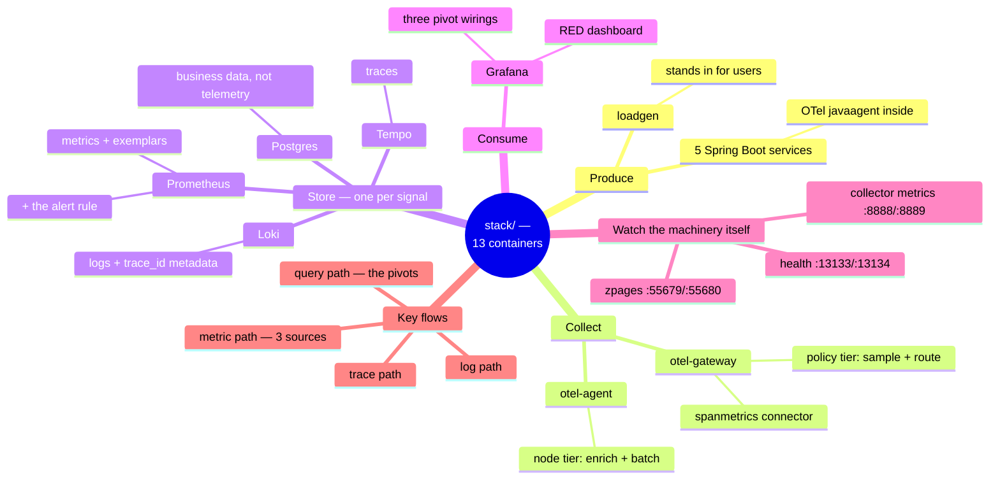

# The Example — How the Running Observability Stack Works

> **Where you are:** **stage 2 (example)** of the [learning path](../../README.md) — the tour of the runnable stack.
> **What you'll know after this pack:** what every container in [`stack/`](../../stack/README.md) does, how the three signal paths flow through them, and how to *watch each component doing its job* on your own machine.

Stage 1 ([concepts](../01-concepts/00-overview.md)) teaches the ideas; stage 3 ([deep dives](../03-deep-dives/README.md)) opens each player up; **this pack is the concrete instance in between** — the same ideas, but every box is a real container with a port you can curl. Nothing is redefined here: every concept links back to where it was introduced.

## The whole territory in one mindmap

## Reading order

| File | Stage | Question it answers |
|---|---|---|
| [01-why.md](01-why.md) | WHY | Why does each container earn its place? (concept → container map) |
| [02-what.md](02-what.md) | WHAT | What exactly is each of the 13 containers — image, port, config file? |
| [03-how.md](03-how.md) | HOW | How do the three signal paths and the query path actually flow? *(the heart)* |
| [04-walkthrough.md](04-walkthrough.md) | WALKTHROUGH | One checkout, followed hop by hop with real commands |
| [05-next-steps.md](05-next-steps.md) | — | Exercises that poke each component (including breaking one on purpose) |

➡ **Next:** [01-why.md](01-why.md)
