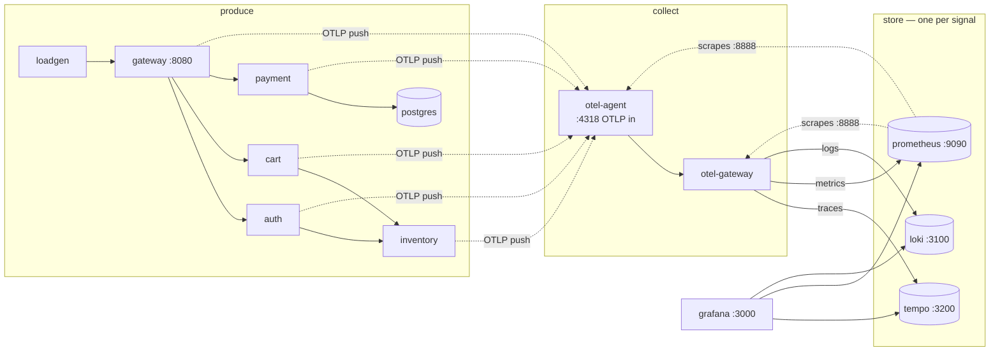

# Stage 2 — WHAT: the 13 containers, precisely

> **Where you are:** Stage 2 of 4. You know why each container exists ([01](01-why.md)).
> **What you'll know after this file:** for every container — image, ports, config file, and the one thing it deliberately does not do.

## The inventory

| Container | Image (pinned) | Host ports | Config lives in | Deliberately does NOT |
|---|---|---|---|---|
| `gateway` | built from [`services/`](../../stack/services/Dockerfile) | 8080 | [`gateway/…/application.yaml`](../../stack/services/gateway/src/main/resources/application.yaml) | know about any backend — it only speaks OTLP to `otel-agent` |
| `auth`, `cart`, `inventory` | same build | — | each module's `application.yaml` | any manual instrumentation — they show what the javaagent gives you for free |
| `payment` | same build | — | [`payment/…/application.yaml`](../../stack/services/payment/src/main/resources/application.yaml) | hide its bottleneck — the Hikari pool size is env-driven on purpose |
| `postgres` | `postgres:16-alpine` | — | compose env | emit telemetry (it's the *subject* of observation via payment's spans) |
| `loadgen` | `curlimages/curl:8.14.1` | — | [`loadgen/loadgen.sh`](../../stack/loadgen/loadgen.sh) | wait for responses (open-loop — see README §incident) |
| `otel-agent` | `otel/opentelemetry-collector-contrib:0.156.0` | 13133 health · 55679 zpages · 8888 self-metrics | [`otel/collector-agent.yaml`](../../stack/otel/collector-agent.yaml) | sample, analyze, or talk to backends — it enriches, batches, forwards |
| `otel-gateway` | same image | 13134 health · 55680 zpages · 8889 self-metrics | [`otel/collector-gateway.yaml`](../../stack/otel/collector-gateway.yaml) | retain anything beyond its sampling buffer and export queues |
| `tempo` | `grafana/tempo:2.8.1` | 3200 | [`tempo/tempo.yaml`](../../stack/tempo/tempo.yaml) | metrics or logs; alerting |
| `prometheus` | `prom/prometheus:v3.13.0` | 9090 | [`prometheus/prometheus.yml`](../../stack/prometheus/prometheus.yml) + [`rules.yml`](../../stack/prometheus/rules.yml) | per-request detail — that's what exemplars *point away* to |
| `loki` | `grafana/loki:3.7.3` | 3100 | [`loki/loki.yaml`](../../stack/loki/loki.yaml) | parse/structure your logs for you — structure arrives from the OTel appender |
| `grafana` | `grafana/grafana:12.0.2` | 3000 | [`grafana/provisioning/`](../../stack/grafana/provisioning/datasources/datasources.yaml) | store telemetry — kill it and re-create it; nothing is lost |

## The network, drawn

*Caption: the compose network by role — producers push OTLP to the agent tier; only the gateway tier knows the backends; Grafana only knows the backends; and Prometheus watches the watchers by scraping both collectors.*

One boundary worth stating twice: **telemetry flows left-to-right only.** No service knows Tempo exists; no backend knows the shop exists. The two Collector containers are the only place where "where does telemetry go" is decided — which is the entire point of the [pipeline concept](../03-deep-dives/otel/03c-collector.md).

**Quality bar check:** given any port number from the table you can say which component answers it and what you'd learn by opening it.

➡ **Next:** [03-how.md](03-how.md) — the heart: the four paths through this diagram.
