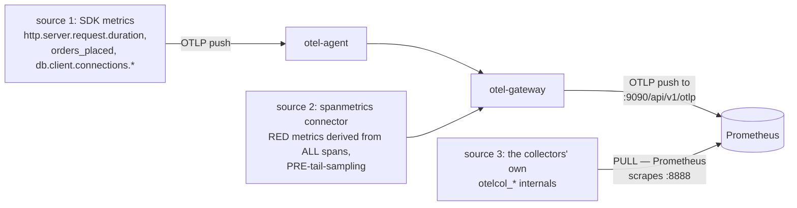

# Stage 3 — HOW: the four paths through the stack

> **Where you are:** Stage 3 of 4, the heart. You know the containers ([02](02-what.md)).
> **What you'll know after this file:** exactly how each signal travels — which config key in which file makes each hop happen — plus the reverse path queries take. Every claim here is checkable in [04-walkthrough.md](04-walkthrough.md).

---

## 3.1 The trace path

```mermaid
sequenceDiagram
    autonumber
    participant SVC as service JVM (javaagent)
    participant OA as otel-agent
    participant OG as otel-gateway
    participant TP as Tempo

    Note over SVC: agent weaves spans into Tomcat/RestClient/JDBC;<br/>manual "checkout" span from CheckoutController
    SVC--)OA: OTLP/HTTP :4318 (BatchSpanProcessor flush, ~5s)
    Note over OA: memory_limiter → resource (adds deployment.environment) → batch
    OA--)OG: OTLP/gRPC :4317
    Note over OG: tail_sampling buffers the trace 10s,<br/>then votes: error? slow? 25% baseline?
    OG--)TP: otlp/tempo exporter (kept traces only)
    Note over OG: the SAME spans also feed the<br/>spanmetrics connector — see metric path
```
*Caption: a span's four hops. Config anchors: the app side is pure env (`OTEL_EXPORTER_OTLP_ENDPOINT` in [docker-compose.yml](../../stack/docker-compose.yml)); the two collector legs are the `traces` pipelines in [collector-agent.yaml](../../stack/otel/collector-agent.yaml) and [collector-gateway.yaml](../../stack/otel/collector-gateway.yaml).*

Two things to notice, because they're the design showing through:

- **Context propagation is invisible here** — it happened earlier, inside the request path (`traceparent` header between services, [deep dive 03b](../03-deep-dives/otel/03b-context.md)). By the time spans reach the Collectors they already share a trace_id; the pipeline never joins anything.
- **The sampling decision is at the last possible moment.** Head sampling is off (`parentbased_always_on`), so every span crosses both collector hops and only Tempo's doorstep is guarded. That is the tail-sampling trade from [deep dive 03d](../03-deep-dives/otel/03d-sampling.md): full transport cost, perfect information.

## 3.2 The metric path — three sources, one store


*Caption: three metric origins converge on one TSDB. Anchors: source 1 is the javaagent's default meters; source 2 is the `spanmetrics` connector + the `traces/spanmetrics` pipeline in [collector-gateway.yaml](../../stack/otel/collector-gateway.yaml); source 3 is `scrape_configs` in [prometheus.yml](../../stack/prometheus/prometheus.yml).*

- **Push and pull coexist**: app metrics arrive by OTLP push (with `--web.enable-otlp-receiver` on Prometheus), while collector self-metrics are pulled — the same asymmetry the [parent guide](../01-concepts/03-how.md) explains, both variants live in this one stack.
- **Order matters**: spanmetrics taps the *unsampled* span stream (its own pipeline, no `tail_sampling`), so dashboard rates are true even though Tempo stores a subset — the [03d caveat](../03-deep-dives/otel/03d-sampling.md), implemented.
- **Exemplars ride along**: the connector attaches a sampled trace_id to histogram buckets (`exemplars: enabled`), which is the raw material for the metric→trace pivot in §3.4.

## 3.3 The log path

No code was written for logging. The chain: `log.warn(...)` → Logback → the javaagent's auto-installed appender turns it into a **LogRecord already stamped with the active span's trace_id** ([deep dive 03a](../03-deep-dives/otel/03a-signals.md)) → same OTLP journey as spans → the gateway's `logs` pipeline → `otlphttp/loki` exporter → Loki's native OTLP endpoint (`/otlp`), where `service_name` becomes a stream label and `trace_id` becomes **structured metadata** (enabled by `allow_structured_metadata` in [loki.yaml](../../stack/loki/loki.yaml)).

The subtle part: *structured metadata is not the log line.* `{service_name="payment"} | trace_id = "abc..."` filters on metadata; grepping the text for the id would find nothing.

## 3.4 The query path — how the pivots are wired

Everything above flows left→right; Grafana reads right→left, and the three "magic" pivot clicks are each one provisioning key in [datasources.yaml](../../stack/grafana/provisioning/datasources/datasources.yaml):

| Click | Wiring key | What it does |
|---|---|---|
| exemplar dot → trace | `exemplarTraceIdDestinations` on the Prometheus datasource | reads the exemplar's `trace_id` label, opens it in Tempo |
| span → its logs | `tracesToLogsV2.query` on the Tempo datasource | templated Loki query: `{service_name=…} \| trace_id = <span's trace id>` |
| log line → trace | `derivedFields` on the Loki datasource | lifts the `trace_id` metadata into a **View trace** link |

No plugin, no glue service — the pivots exist because **every signal carries the same trace_id**, and Grafana just needs to be told which field holds it in each store.

## 3.5 Watching the machinery itself

The pipeline is also observable — three windows into the Collectors:

- **zpages** — http://localhost:55679/debug/pipelinez (agent) and :55680 (gateway): live pipeline graph, per-component span counts, recent traces through the collector itself.
- **Self-metrics** — `otelcol_receiver_accepted_spans`, `otelcol_exporter_sent_spans`, `otelcol_processor_tail_sampling_count_traces_sampled` … query them in Prometheus; accepted-vs-sent per tier shows exactly where the tail sampler culls.
- **Health** — `curl localhost:13133` / `:13134` — what a k8s liveness probe would hit.

**Quality bar check:** you can name the config file and key behind every arrow in the three signal-path diagrams — and predict which `otelcol_*` counter moves when you send one checkout.

➡ **Next:** [04-walkthrough.md](04-walkthrough.md) — verify all of it with your own hands.
