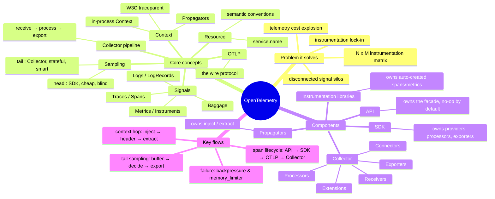

# OpenTelemetry Deep Dive — Guide Overview

> **Where you are:** **stage 3 (depth)** of the [learning path](../../../README.md) — the first entry in the [deep-dive index](../README.md). This pack zooms into concept #1–#4 of the [stage-1 concepts guide](../../01-concepts/00-overview.md): what that guide covered in four table rows, this covers in four files.
> **What you'll know after this pack:** OTel's internal anatomy — how a signal is born (API/SDK), how context stitches signals across processes, how the Collector pipeline is built, and how sampling keeps the bill sane without losing the interesting traces.

**Sources:** [opentelemetry.io/docs/concepts](https://opentelemetry.io/docs/concepts/) and [opentelemetry.io/docs/collector](https://opentelemetry.io/docs/collector/).

## The whole territory in one mindmap

## Reading order

| File | Stage | Question it answers |
|---|---|---|
| [01-why.md](01-why.md) | WHY | What pain forced a *standard* for telemetry into existence? |
| [02-what.md](02-what.md) | WHAT | What exactly is OTel — and what does it deliberately *not* do? |
| [03-how.md](03-how.md) | HOW (map) | The 7 concepts, and who owns what — the master map |
| [03a-signals.md](03a-signals.md) | HOW (deep) | Anatomy of traces, metrics, logs, baggage |
| [03b-context.md](03b-context.md) | HOW (deep) | How context crosses threads and network hops |
| [03c-collector.md](03c-collector.md) | HOW (deep) | Collector components, pipelines, deployment, failure modes |
| [03d-sampling.md](03d-sampling.md) | HOW (deep) | Head vs tail sampling, samplers, the two-tier trick |
| [04-walkthrough.md](04-walkthrough.md) | WALKTHROUGH | One Spring Boot checkout request, followed atom by atom |
| [05-next-steps.md](05-next-steps.md) | — | Exercises, doc entry points, and your Prompt.md TODOs |

➡ **Next:** [01-why.md](01-why.md)
