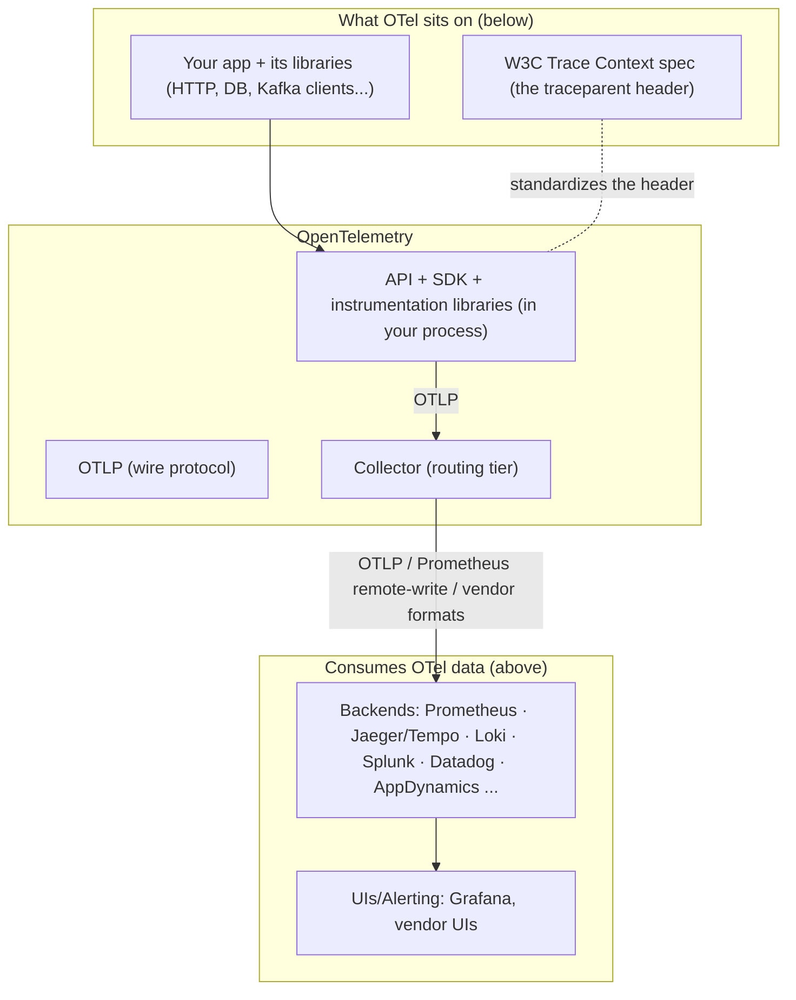

# Stage 2 — WHAT: Definition, boundaries, ecosystem position

> **Where you are:** Stage 2 of 4. You know the three pains ([01](01-why.md)).
> **What you'll know after this file:** exactly what OTel is, the surprisingly important list of what it is *not*, and where it sits in the stack.

## One-sentence definition

**OpenTelemetry is a vendor-neutral observability framework — APIs, SDKs, a wire protocol (OTLP), and a routing service (the Collector) — that solves telemetry lock-in and signal silos by standardizing how traces, metrics, and logs are produced, correlated through shared context, and shipped, while leaving storage and analysis to any backend you choose.**

Unpack: *[APIs, SDKs, protocol, Collector]* = it's a toolkit, not one binary; *[lock-in, silos]* = the Stage-1 pains; *[shared context]* = the correlation mechanism, explained in [03b](03b-context.md); *[leaving storage to backends]* = the boundary that defines the whole project.

## Boundaries — what OTel is NOT

This list prevents the most common misconceptions:

- **Not a backend.** OTel has no database, no query language, no dashboards, no alerting. `otel-collector` retains data for seconds (buffers), not days. You always pair it with Prometheus/Jaeger/Tempo/Splunk/vendor-of-choice. *Deliberate:* competing with backends would kill the vendor coalition that makes the standard work.
- **Not just tracing, and not just "the new OpenTracing."** It's all signals, sharing one context.
- **Not an observability *strategy*.** It standardizes production and transport; what to collect, what SLOs to set, what to alert on remain your decisions.
- **Not zero-config magic everywhere.** Auto-instrumentation is excellent in Java/.NET/Python/Node, thinner elsewhere (Go relies mostly on explicit library wrappers or eBPF). Business-level spans and metrics are always manual.

## Position in the ecosystem

*Caption: OTel is the layer between your code and every backend — it standardizes the producing side and stays out of the storing/analyzing side.*

**Closest neighbors, one line each:**

| Neighbor | Relationship |
|---|---|
| **OpenTracing / OpenCensus** | Predecessors, merged into OTel, both archived — choose OTel, always |
| **Prometheus client libraries** | Overlapping for metrics; OTel SDK can *expose* Prometheus format, and the Collector can *scrape* Prometheus targets — they interoperate rather than compete |
| **Fluent Bit / Logstash / Vector** | Overlapping for log shipping; the Collector increasingly covers this (filelog receiver), but log-specialist shippers remain common alongside it |
| **Vendor agents (AppD, Datadog...)** | Historically competitors; today every major vendor *accepts OTLP* — the strategic victory described in [01](01-why.md) |
| **eBPF auto-instrumentation (Beyla, Odigos...)** | Emerging "zero-code" producers that *emit* OTel signals — feeders, not rivals |

**Quality bar check:** you can now decide relevance in one breath — "we produce telemetry from services and want backend freedom" → OTel applies; "we need a place to *store* telemetry" → OTel is not that, pick a backend from the row above it.

➡ **Next:** [03-how.md](03-how.md) — the heart.
