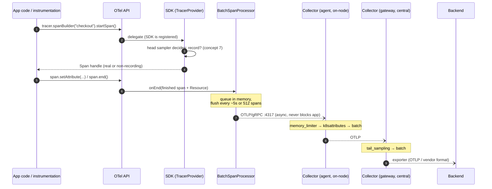
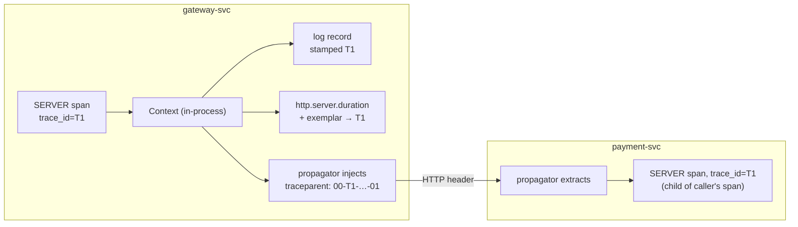

# Stage 3 — HOW: The master map (concepts, components, coordination)

> **Where you are:** Stage 3 of 4, the heart. You know the pains ([01](01-why.md)) and the boundaries ([02](02-what.md)).
> **What you'll know after this file:** the 7 core concepts in dependency order, the owns/knows/does-not-do contract of every component, and the two flows that tie them together. Files [03a](03a-signals.md)–[03d](03d-sampling.md) then go deep on each area.

---

## 3.1 Domain mapping — from problem to concepts

Seven concepts, in dependency order (each builds only on the ones above it):

| # | Real-world problem element | OTel concept | One-line definition & why this abstraction |
|---|---|---|---|
| 1 | "Evidence about one request / one quantity / one event" | **Signal** | A typed telemetry stream. OTel defines four: **traces** (trees of timed spans), **metrics** (aggregated measurements from *instruments*), **logs** (timestamped records, bridged from existing loggers), **baggage** (user key-values riding along the request). Typed, because each is produced, transported, and stored differently. → deep dive [03a](03a-signals.md) |
| 2 | "*Who* emitted this?" | **Resource** | An immutable set of attributes describing the emitting entity (`service.name`, `service.version`, `k8s.pod.name`...), attached to *every* signal at SDK init. Named by **semantic conventions** — standardized attribute keys — so every backend can group by the same names. |
| 3 | "Libraries must instrument without forcing a vendor or a runtime cost" | **API / SDK split** | The **API** is a facade of interfaces that no-ops when nothing is registered; the **SDK** is the swappable implementation an *application* (never a library) installs. This one split is what dissolved the N×M matrix of [Stage 1](01-why.md). |
| 4 | "Signals from hop A and hop B belong to the same request" | **Context & propagation** | An immutable, in-process **Context** holds the active span (and baggage); **Propagators** serialize it into wire headers (W3C `traceparent`) on outgoing calls and restore it on incoming ones. The correlation key of the whole system. → deep dive [03b](03b-context.md) |
| 5 | "All this needs one wire format" | **OTLP** | The OpenTelemetry Protocol: one protobuf schema for all signals, over gRPC (`:4317`) or HTTP/protobuf (`:4318`). The lingua franca between SDKs, Collectors, and (now) every major backend. |
| 6 | "Route, clean, and buffer telemetry without touching app code" | **Collector pipeline** | A standalone process running `receivers → processors → exporters` pipelines per signal type. The operational heart of a deployment. → deep dive [03c](03c-collector.md) |
| 7 | "100% of traces is unaffordable; 1% uniformly is blind" | **Sampling** | Keeping a representative subset of traces. **Head** sampling decides at trace start (cheap, in the SDK); **tail** sampling decides after the trace completes (smart, in the Collector, stateful). → deep dive [03d](03d-sampling.md) |

Everything else in the OTel docs (views, exemplars, spanmetrics, zPages, OTTL...) is **derived** from these seven.

---

## 3.2 Responsibility assignment — from concepts to components

| Component | **Owns** | **Knows** | **Deliberately does NOT do** |
|---|---|---|---|
| **API** (`opentelemetry-api`) | The stable facade: `Tracer`, `Meter`, `Logger`, `Context`, `Propagator` interfaces (concepts 3, 4) | Nothing at runtime by default — every call is a no-op until an SDK registers | Implement anything. Libraries depend on it precisely *because* it does nothing on its own |
| **SDK** (`opentelemetry-sdk`) | The implementation the app installs: `TracerProvider`/`MeterProvider`/`LoggerProvider`, Resource, span/log **processors**, metric **readers**, **exporters**, head **sampler** (concepts 1–3, 7-head) | Live telemetry state: spans in flight, metric accumulations, the export queue | Cross-process transport decisions beyond "send OTLP somewhere"; long-term buffering; tail sampling |
| **Instrumentation libraries / agent** | Auto-creating spans, metrics, and context hops for known frameworks (Spring MVC, JDBC, Kafka...) — via the Java agent's bytecode weaving or per-library packages | Framework internals: where a request starts, where an outgoing call leaves | Business semantics — it can time `POST /checkout`, it cannot know what "checkout" means. That's your manual instrumentation |
| **Propagators** (`W3CTraceContext`, `W3CBaggage`) | Inject/extract context ↔ carrier headers (concept 4) | The header formats, nothing else | Transport anything themselves — instrumentation calls them at each hop |
| **Collector — Receivers** | Getting data in: OTLP, but also scraping Prometheus targets, tailing files, accepting Jaeger/Kafka... | Listening endpoints and source protocols | Transform anything — hand off raw |
| **Collector — Processors** | Everything in between: `memory_limiter`, `batch`, filter/transform (OTTL), `k8sattributes`, `tail_sampling` (concepts 6, 7-tail) | Only in-flight batches (plus buffered trace state for tail sampling) | Speak any wire protocol |
| **Collector — Exporters** | Delivery out, with per-exporter retry + queue: OTLP, `prometheusremotewrite`, vendor formats | Backend endpoints, credentials, queue state | Decide *what* gets sent — that's processors |
| **Collector — Connectors** | Being an exporter of pipeline A and a receiver of pipeline B: e.g. `spanmetrics` turns spans into RED metrics | Both pipelines' data models | Leave the Collector process |
| **Collector — Extensions** | Non-pipeline services: `health_check`, `pprof`, `zpages` | Operational state of the Collector itself | Touch telemetry data at all |
| **Backend** (out of scope) | Storage + query + alerting | — | Everything above: OTel's boundary from [02](02-what.md) |

> **The design insight:** every component is either *ignorant of vendors* (API, SDK core, propagators) or *swappable per vendor* (exporters, receivers). Lock-in was engineered out structurally — there is no component whose replacement requires touching instrumentation code.

---

## 3.3 Coordination — the two flows that tie it together

### Flow A — the trunk: one span's life from API call to backend

*Caption: how a span travels — and where each concept sits: sampling twice (head in SDK, tail in gateway), Resource attached in the SDK, OTLP on every hop after the process boundary. Metrics and logs follow the same trunk with `MetricReader`/`LogRecordProcessor` in place of the span processor.*

Three coordination rules:

1. **Nothing between APP and BSP crosses a network** — everything in-process, so a dead Collector can never block a request thread. Queues overflow → spans drop, app never notices (Stage-1 constraint 4).
2. **The agent/gateway split mirrors the concern split:** node-local enrichment and quick offload at the agent; fleet-wide policy (tail sampling, vendor routing, credentials) at the gateway. Small deployments legitimately skip either or both — see [03c](03c-collector.md).
3. **Head sampling gates *recording*; tail sampling gates *keeping*.** A head-dropped span costs almost nothing and is gone forever; a tail-dropped span cost full production and transport. That price difference drives the whole sampling design in [03d](03d-sampling.md).

### Flow B — the correlation miracle: one request, three signals, one trace_id

*Caption: the in-process Context is the hub — spans, logs, metrics exemplars, and the outgoing header all read the same trace_id from it. This is concept 4 doing the work the parent guide called "the correlation key."*

The **failure flows** — Collector backpressure, gateway death, tail-sampling state loss — are covered where their mechanisms live: [03c §failure modes](03c-collector.md) and [03d §caveats](03d-sampling.md).

**Quality bar check:** you should be able to whiteboard Flow A and name why each box exists: API (free for libraries) → SDK (swappable impl) → processor (async, app-safe) → OTLP (one format) → agent (offload fast) → gateway (central policy) → backend (not OTel's job).

➡ **Next:** [03a-signals.md](03a-signals.md) — the anatomy of each signal.
