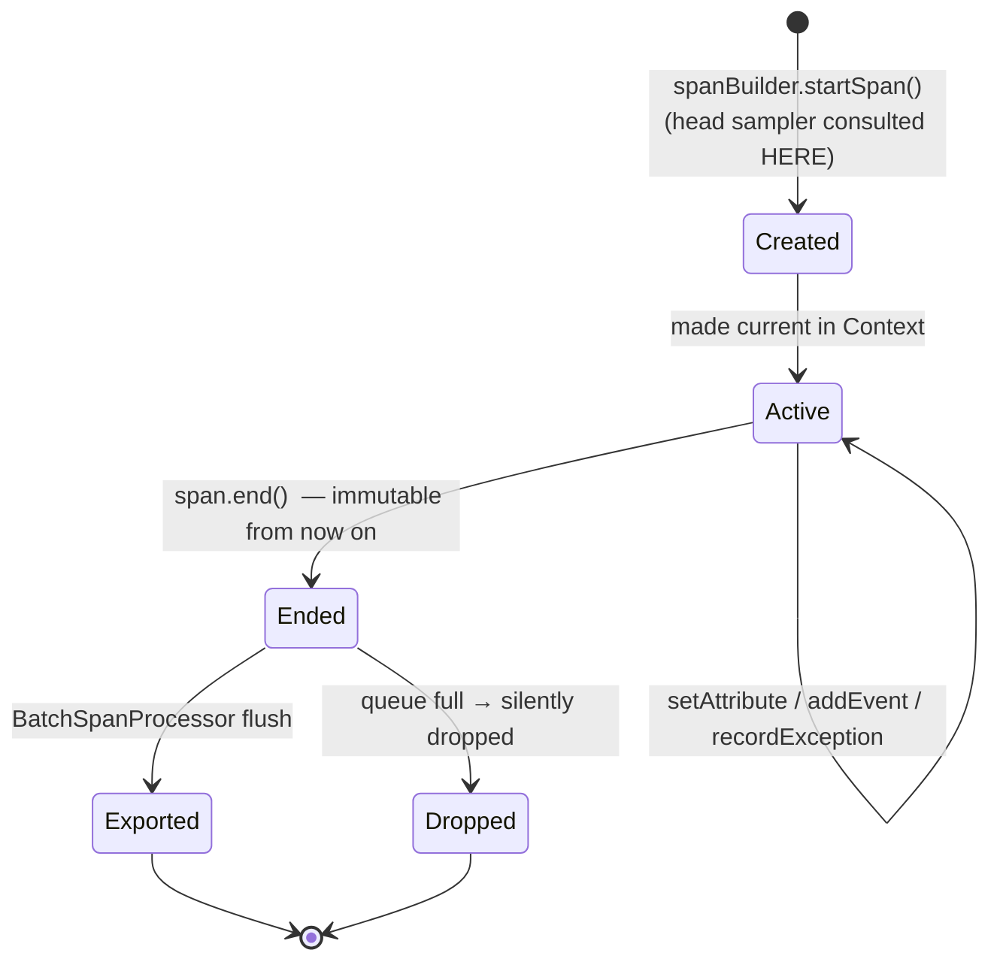

# 3a — Signals: traces, metrics, logs, baggage

> **Where you are:** first deep dive of Stage 3. The [master map](03-how.md) defined *signal* as concept #1.
> **What you'll know after this file:** the exact anatomy of each signal type, which instrument to pick when, and why logs work differently from the other two.

---

## Traces — the request-shaped signal

A **trace** is not an object anywhere in the system: it's the *set of all spans sharing one trace_id*, reassembled by the backend. The unit you actually create is the **span**.

### Anatomy of a span

| Field | What it is | Notes |
|---|---|---|
| **Name** | Low-cardinality operation label | `GET /cart/{id}` — never `GET /cart/8817` (cardinality poisons backend grouping) |
| **SpanContext** | `trace_id` (16 bytes) + `span_id` (8 bytes) + `trace_flags` (sampled bit) + `trace_state` | The immutable, propagatable identity — exactly what goes into `traceparent` ([03b](03b-context.md)) |
| **Parent span id** | Links child → parent | Empty ⇒ this is the **root span** |
| **Kind** | `SERVER` / `CLIENT` / `INTERNAL` / `PRODUCER` / `CONSUMER` | Lets backends infer sync RPC pairs (CLIENT→SERVER) vs async links (PRODUCER→CONSUMER) |
| **Start / end timestamps** | Nanosecond precision | Duration is derived, not stored |
| **Attributes** | Key-value facts: `http.response.status_code`, `cart.item_count` | Keys from semantic conventions where one exists |
| **Events** | Timestamped point-annotations *within* the span | e.g. an exception with stack trace — a mini-log riding inside the span |
| **Links** | References to *other* SpanContexts | For fan-in: one batch-consumer span linking 50 producer traces it can't be a child of |
| **Status** | `Unset` / `Ok` / `Error` | `Error` is what tail sampling and alerting key on — set it deliberately |

### The lifecycle (a state you should know cold)

*Caption: why late attributes are lost — everything after `end()` is ignored, and why sampling must be head-decidable at `startSpan()` time.*

---

## Metrics — the aggregate-shaped signal

The metrics API is built around **instruments** owned by a `Meter`. You record *measurements*; the SDK aggregates them and a `MetricReader` exports the aggregate periodically (default: every 60 s). Individual measurements never leave the process — that's the entire cost advantage over spans.

### Choosing the instrument — the only decision that matters

| Instrument | Semantics | Example | Backend query it enables |
|---|---|---|---|
| **Counter** | Monotonic sum | `orders_placed` | `rate()` |
| **UpDownCounter** | Sum that can fall | `active_sessions` | current value |
| **Histogram** | Distribution of values | `http.server.duration` | p50/p95/p99 |
| **Gauge** | Last value, non-additive | `cpu.temperature` | current value (summing is meaningless) |
| **Observable*** (async variants) | You register a callback; SDK reads on each export | `jvm.memory.used` | for values you *observe*, not *count* |

Rule of thumb: *counting events* → Counter; *timing things* → Histogram; *reading a level* → Gauge/UpDownCounter (async if you poll it).

### Three SDK-side mechanisms worth knowing

- **Views** — SDK-level config that renames instruments, drops attributes (cardinality control!), or changes histogram buckets, *without touching instrumentation code*. The metrics analogue of the API/SDK split.
- **Exemplars** — sampled measurement points carrying the current trace_id, attached to metric data. This is the mechanic behind Grafana's "click the latency spike → jump to trace" pivot from the [parent guide](../../01-concepts/03-how.md).
- **Temporality** — cumulative (each export = total since start, Prometheus-style) vs delta (each export = change since last, Datadog-style). Exporters pick a default; you mostly care when debugging "why does my counter look weird in backend X."

---

## Logs — the bridged signal

Logs are deliberately different: the world already has log4j/slf4j/logback/zap/winston, and OTel decided **not to replace them**. Instead of a user-facing "log API" like `Tracer`/`Meter`, OTel defines:

1. A **LogRecord data model** — timestamp, severity, body, attributes, Resource, and crucially `trace_id` + `span_id` fields;
2. A **Logs Bridge API** — implemented by *appenders* that plug into your existing framework (e.g. the Logback/Log4j OTel appender), not called by your code;
3. The same SDK pipeline shape as spans: `LogRecordProcessor` → OTLP exporter.

The payoff: your existing `log.error("payment failed")` call, unchanged, becomes a structured LogRecord that is **automatically stamped with the active span's trace_id** because the appender reads the same Context ([03b](03b-context.md)). Correlation without grep-glue — pain 3 of [Stage 1](01-why.md), dissolved.

> Also in this family: **profiles** (continuous profiling) — a newer signal under active development; know it exists, build on the stable four.

---

## Baggage — the odd one out

**Baggage** is user-defined key-values propagated across hops in its own `baggage` header. It is *not stored telemetry* — it's a distribution mechanism: put `tenant.id=acme` in at the edge, and any downstream service can read it and copy it onto *its own* spans/metrics as attributes.

Two warnings that are basically the whole baggage doc: it rides on **every** downstream request (keep it tiny), and it's plaintext visible to every hop (never put secrets in it). Baggage ≠ span attributes — nothing lands in a backend unless some service explicitly copies it.

**Quality bar check:** you can now answer — Where does a p99 come from? (histogram buckets, aggregated in-process.) Why did my log line get a trace_id for free? (appender reads the shared Context.) When do I use a link instead of a parent? (fan-in/batch.) What's the *only* signal that isn't telemetry? (baggage.)

➡ **Next:** [03b-context.md](03b-context.md) — the Context those signals all read from.
