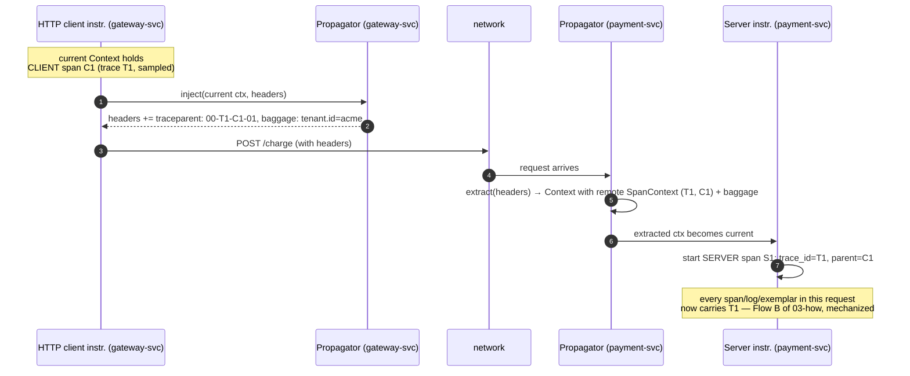

# 3b — Context & propagation: how signals stay stitched

> **Where you are:** second deep dive of Stage 3. You know the signals ([03a](03a-signals.md)); now the mechanism that makes them one story.
> **What you'll know after this file:** the in-process Context, the exact bytes of `traceparent`, and the inject/extract dance at every network hop — including the async edge cases where it breaks.

---

## Two problems, one mechanism

Correlation has an **in-process** half (the log call on line 200 must find the span started on line 50, across threads) and a **cross-process** half (payment-svc must continue gateway-svc's trace). OTel solves them with two cooperating pieces:

### 1. Context — the in-process half

`Context` is an **immutable bag of key-values**; the two values that matter are the *active span* and the *baggage*. Immutability means you never mutate a context — you derive a new one (`context.with(span)`), which makes it safe to share across threads.

Each language pins a "current" context to the execution unit using whatever the runtime offers: `ThreadLocal` (Java), `contextvars` (Python), `AsyncLocalStorage` (Node), explicit `ctx context.Context` parameters (Go — no magic storage, which is why Go instrumentation is more manual). "Make this span current" = push a derived context; instrumentation and log appenders just read the current one.

**Where it breaks:** any time work jumps execution units *outside* the runtime's tracking — a hand-rolled thread pool, a queue between goroutines. Symptom: orphan spans starting new traces mid-request. Fix: instrumented executors (the Java agent wraps `ExecutorService` for you) or manually carrying the Context object across.

### 2. Propagators — the cross-process half

A `TextMapPropagator` does exactly two operations, called by instrumentation (never by you, usually):

- **`inject(context, carrier)`** — serialize the current SpanContext + baggage into a carrier's string pairs (HTTP headers, Kafka message headers...)
- **`extract(carrier, context)`** — parse incoming headers back into a Context, so the first span created on the server side becomes a *remote child* rather than a new root.

The default propagator pair is **W3C Trace Context** + **W3C Baggage**. (Legacy alternatives you'll meet in the wild: B3 from Zipkin, `uber-trace-id` from Jaeger — configurable via `OTEL_PROPAGATORS` when you must interop.)

## The bytes on the wire

```text
traceparent: 00-4bf92f3577b34da6a3ce929d0e0e4736-00f067aa0ba902b7-01
             │  │                                │                │
             │  └ trace-id (16 bytes hex)        └ parent-id      └ trace-flags
             └ version                             (= span-id       (01 = sampled)
                                                    of the caller)
tracestate:  vendor1=opaque,vendor2=opaque    ← vendor-specific baton, rarely yours to touch
baggage:     tenant.id=acme,checkout.flow=v2  ← user key-values (03a)
```

The **trace-flags sampled bit** is load-bearing: it carries the *head sampling decision* downstream, so all services agree on recording the trace or not — the mechanism behind `ParentBased` sampling in [03d](03d-sampling.md).

## The hop, drawn once


*Caption: how trace identity survives a network hop — inject serializes, extract deserializes, and the first server-side span parents itself to the caller's span-id.*

**Async variant:** through Kafka/RabbitMQ the dance is identical (inject into *message* headers), but the consumer span uses kind `CONSUMER` and — when one poll processes many messages — **links** ([03a](03a-signals.md)) instead of a single parent.

## Failure modes worth memorizing

| Symptom | Cause |
|---|---|
| Traces "cut" at one service — downstream spans start fresh traces | That service strips unknown headers (old proxies!), or its instrumentation has no propagator configured |
| Two teams' traces don't join | Propagator mismatch (one side B3, other W3C) — align `OTEL_PROPAGATORS` |
| Orphan spans mid-service | Context lost crossing an untracked thread pool / async boundary (see above) |
| A rogue client dictates your sampling | You honor inbound `traceparent` sampled-flags from the public internet — extract at the edge should start a *new* root or re-decide |

**Quality bar check:** given a `traceparent` string you can name every field; given a broken trace you can say which half (in-process vs cross-process) failed and where to look.

➡ **Next:** [03c-collector.md](03c-collector.md) — everything after the telemetry leaves the process.
