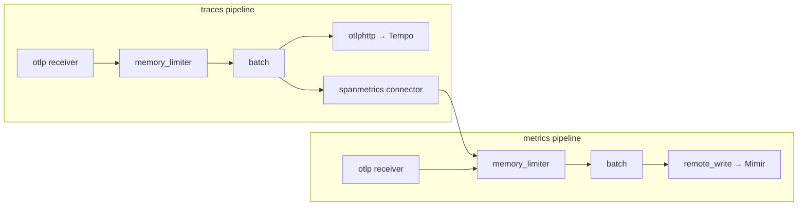
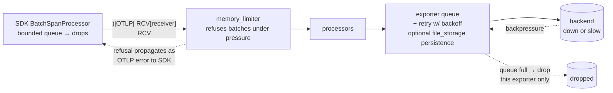

# 3c — The Collector: pipelines, deployment, failure modes

> **Where you are:** third deep dive of Stage 3. Signals exist ([03a](03a-signals.md)) and stay correlated ([03b](03b-context.md)); now the machine that moves them.
> **What you'll know after this file:** the five component types, how a config file becomes pipelines, when to deploy agent vs gateway, and what happens when things back up.

---

## What it is, in one line

A single Go binary that runs configurable `receivers → processors → exporters` **pipelines** — the vendor-agnostic middle tier that receives, processes, and exports telemetry so that apps offload fast and backends become a config choice ([concept 6](03-how.md)).

Could apps export straight to backends? Yes — and for dev that's fine (the *no-collector* pattern). Production wants the middle tier because it centralizes what you must *not* scatter across 50 services: retries, batching, credentials, PII scrubbing, sampling policy, and vendor routing.

## The five component types

| Type | Role | Workhorses you'll actually use |
|---|---|---|
| **Receivers** | Data in (listen or scrape) | `otlp` (gRPC :4317 / HTTP :4318); `prometheus` (scrapes targets!), `filelog` (tails files), `jaeger`, `kafka`, `hostmetrics` |
| **Processors** | Transform in flight | `memory_limiter` (always first), `batch` (always ~last), `attributes`/`resource` (add/drop/rename), `filter`, `transform` (OTTL language), `k8sattributes` (pod metadata enrichment), `tail_sampling` ([03d](03d-sampling.md)) |
| **Exporters** | Data out, with retry + persistent queue | `otlp`/`otlphttp`, `prometheusremotewrite`, `debug` (to console), vendor exporters (`splunk_hec`, `datadog`...) |
| **Connectors** | Exporter of pipeline A + receiver of pipeline B | `spanmetrics` (spans → RED metrics), `servicegraph`, `forward` |
| **Extensions** | Side services, touch no telemetry | `health_check`, `pprof`, `zpages` (live pipeline debugging) |

## Config anatomy — define, then wire

The config has two halves and the second is the one people forget: **defining a component does nothing until a pipeline references it.**

```yaml
receivers:
  otlp:
    protocols: { grpc: {}, http: {} }
processors:
  memory_limiter: { check_interval: 1s, limit_percentage: 80 }
  batch: {}
exporters:
  otlphttp/tempo: { endpoint: http://tempo:4318 }
  prometheusremotewrite: { endpoint: http://mimir:9009/api/v1/push }
connectors:
  spanmetrics: {}

service:
  pipelines:
    traces:
      receivers: [otlp]
      processors: [memory_limiter, batch]
      exporters: [otlphttp/tempo, spanmetrics]   # fan-out: both get every batch
    metrics:
      receivers: [otlp, spanmetrics]             # ← connector re-enters here
      processors: [memory_limiter, batch]
      exporters: [prometheusremotewrite]
```


*Caption: the YAML above, drawn — pipelines are per-signal, exporters fan out, and the connector is the bridge that turns spans into metrics inside the same process.*

Rules of thumb: `memory_limiter` first (refuse before you swell), `batch` last before exporters (compress the network), one pipeline per signal type, `name/instance` syntax (`otlphttp/tempo`) for multiple instances of one component type.

**Distributions:** the same engine ships in flavors — **core** (minimal, curated), **contrib** (~everything; where `tail_sampling`, `k8sattributes`, vendor exporters live — the usual choice), **k8s**, and **otlp-only**. For production hardening, build a custom binary containing *only* your components with the **OpenTelemetry Collector Builder (`ocb`)**. Component maturity varies individually — check each component's README, not just the distro.

## Deployment patterns — the real decision

| Pattern | Topology | Choose when |
|---|---|---|
| **No collector** | SDK → backend directly | Dev, demos, tiny setups |
| **Agent** | SDK → Collector on the same node (DaemonSet / sidecar) → backend | Default production baseline: apps offload in microseconds; agent adds node/pod metadata (`k8sattributes`) no central box could know |
| **Gateway** | SDKs/agents → load-balanced central Collector tier → backends | You need fleet-wide policy in one place: tail sampling, PII scrubbing, egress credentials, per-vendor routing |
| **Agent + gateway** | Both | The common end-state at scale; exactly Flow A of [03-how](03-how.md) |

The trade is locality vs centrality: agents know *node* things and are near the app; gateways see *whole traces* and hold *one* copy of policy and secrets. Tail sampling forces a gateway tier by definition — a per-node agent can never see all spans of a distributed trace ([03d](03d-sampling.md) shows the load-balancing trick this requires).

## Failure modes — coordination under stress

The pipeline is a chain of queues; know how it sheds load:


*Caption: where telemetry goes to die, deliberately — every stage prefers dropping data over blocking the application or OOM-ing the Collector.*

- **Backend down:** that exporter's queue absorbs, retries with backoff, then drops — *other* exporters in the fan-out keep flowing (blast-radius isolation per backend). Add the `file_storage` extension for a queue that survives Collector restarts.
- **Collector overwhelmed:** `memory_limiter` starts refusing; refusal propagates back as OTLP errors; SDK queues fill and drop at the source. Graceful degradation end to end, app threads never blocked.
- **Collector down:** SDK retries briefly, drops. This is why the agent runs on-node (nearly nothing to lose on the first hop) — and why the Collector's own `health_check` + internal metrics feed Prometheus, the "watcher's watcher" pattern from the [parent guide](../../01-concepts/03-how.md).

**Quality bar check:** you can read any collector YAML and draw its pipelines; you can argue agent vs gateway for a given org; and for each failure ("Splunk ingest is lagging") you can say which queue fills and what gets dropped.

➡ **Next:** [03d-sampling.md](03d-sampling.md) — the policy that gateway tier exists to run.
