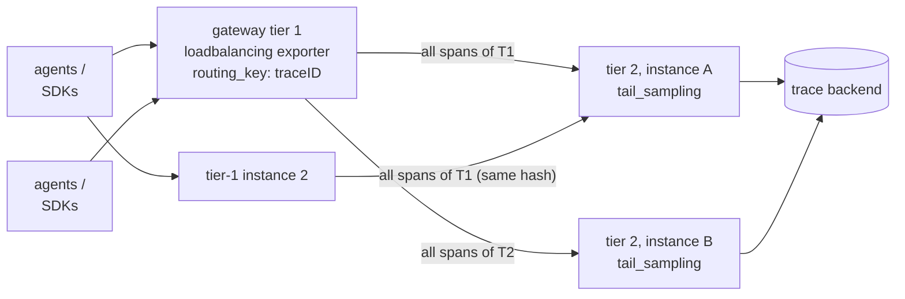

# 3d — Sampling: keeping the interesting 1%

> **Where you are:** last deep dive of Stage 3. You know how traces are made ([03a](03a-signals.md)), stitched ([03b](03b-context.md)), and transported ([03c](03c-collector.md)); now — which ones to keep.
> **What you'll know after this file:** when to sample at all, the head samplers and their interplay with the `traceparent` flag, tail sampling policies, and the two-tier architecture tail sampling forces on you.

---

## Whether to sample at all

Sampling exists because trace volume scales with traffic while trace *value* doesn't: at 1000+ traces/sec, the millionth healthy `GET /health` teaches you nothing the first thousand didn't. Per the OTel docs: sample when volume is high, most traffic is healthy, and errors/latency have identifiable signatures. **Don't** sample when volume is tiny, or when regulation forbids dropping data. And remember the division of labor from [03a](03a-signals.md): *aggregates come from metrics* — sampling traces doesn't blind your dashboards, only thins your per-request evidence.

## Head sampling — decide at birth

The decision is made in the **SDK, at `startSpan()` on the root span**, with only what's known at that instant — which is why it's cheap and why it can't know "will this trace error?"

| Sampler | Decision rule |
|---|---|
| `AlwaysOn` / `AlwaysOff` | Everything / nothing |
| `TraceIdRatioBased(0.10)` | Keep if a deterministic function of the *trace_id* falls under 10% — same trace_id ⇒ same verdict everywhere ("consistent probability sampling") |
| `ParentBased(root=...)` | **The default wrapper**: if there's a parent, obey its `traceparent` sampled flag; only roots consult the delegate sampler |

`ParentBased(TraceIdRatioBased(0.10))` — set via `OTEL_TRACES_SAMPLER=parentbased_traceidratio` + `OTEL_TRACES_SAMPLER_ARG=0.1` — is the canonical production head config, and it shows the two mechanisms cooperating: the *root* service rolls the dice once, the decision rides the `traceparent` flags bit ([03b](03b-context.md)) to every downstream service, so traces are always kept or dropped **whole**. A downstream service sampling independently would produce Swiss-cheese traces.

**The blindness is structural:** at decision time the error hasn't happened yet. At 10% head sampling you keep 10% of errors too — 90% of your incident evidence, gone. Fixing that requires deciding *after* the trace completes.

## Tail sampling — decide after the whole trace is seen

The Collector's **`tail_sampling` processor** (contrib) buffers spans by trace_id, waits `decision_wait` seconds after the trace goes quiet, then runs **policies** over the *complete* trace:

```yaml
processors:
  tail_sampling:
    decision_wait: 10s          # buffer window per trace
    num_traces: 100000          # max traces held in memory
    policies:
      - name: keep-all-errors
        type: status_code
        status_code: { status_codes: [ERROR] }
      - name: keep-slow
        type: latency
        latency: { threshold_ms: 2000 }
      - name: keep-1pct-of-the-rest
        type: probabilistic
        probabilistic: { sampling_percentage: 1 }
```

Policies OR together (any match ⇒ keep); `and`/`composite` types build richer logic (e.g. "10% of checkout traces, 1% of everything else, capped at N spans/sec" via `rate_limiting`). The result is the observability ideal: **100% of errors and slow traces, ~1% of boring ones** — the "keep diagnostic power at 1% of the storage bill" line from the [parent guide](../03-how.md), now with its mechanism visible.

### The catch: tail sampling is a distributed-systems commitment

To judge a *complete* trace, **every span of that trace must reach the same Collector instance**. One load-balanced gateway pool with round-robin routing silently breaks this — fragments of each trace land on different instances and policies judge partial traces. The fix is a two-tier gateway where tier 1 runs the **`loadbalancing` exporter**, routing by trace_id:


*Caption: how every span of trace T1 converges on one tail-sampler — tier 1 hashes the trace_id to pick the tier-2 instance; adding a tier-2 node re-shards in-flight traces (brief judgment errors), and a tier-2 crash loses its buffered, not-yet-decided traces.*

Costs, stated honestly (the docs are blunt that tail sampling "often ends up vendor-specific"): stateful RAM-hungry Collectors (`num_traces × avg trace size`), `decision_wait` of added latency to export, re-sharding wobble on scale-out, and policy config that becomes a system you own. Vendors sell managed versions of exactly this box.

### Two integration caveats

- **Metrics before the cull:** run the `spanmetrics` connector *before* `tail_sampling` in the pipeline, or your span-derived RED metrics will show post-sampling (wrong) rates.
- **Statistical honesty:** tail-kept "100% of errors + 1% of the rest" is deliberately *not* representative — great for debugging, but naive "error rate = errors/total" math over stored traces is now meaningless. (The `probabilistic` policy records the sampling probability so backends that understand it can re-weight counts.)

## Choosing, in practice

| Situation | Strategy |
|---|---|
| Dev / low volume | No sampling (`AlwaysOn`, the default) |
| High volume, cost-driven, simple | Head: `ParentBased(TraceIdRatioBased)` — one env var, done |
| High volume, must never miss an error trace | Tail sampling at a gateway tier (accept the ops cost) |
| Realistic large system | **Both**: modest head rate (e.g. 25%) caps SDK/network cost, tail policies concentrate the survivors on errors & latency |

**Quality bar check:** you can explain why `ParentBased` needs the `traceparent` flags bit, why tail sampling forces trace-id-routed two-tier gateways, and why head+tail compose rather than compete (they gate different costs: production vs retention).

➡ **Next:** [04-walkthrough.md](04-walkthrough.md) — every concept from 03a–03d, run once through a Spring Boot checkout.
